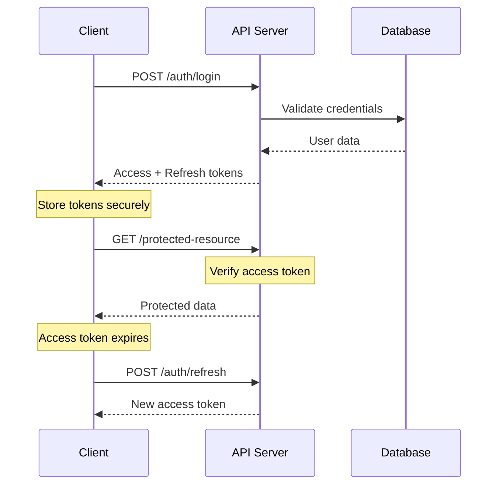

# 🚀 MyLightWay API - Documentação Completa

> **API REST completa para a plataforma cristã de educação infantil MyLightWay**

<div align="center">

[](https://api.mylightway.com/v1)
[](https://api.mylightway.com/docs)
[](https://documenter.getpostman.com/view/mylightway)

[🌐 Base URL](https://api.mylightway.com/v1) · [📋 Postman Collection](https://documenter.getpostman.com/view/mylightway) · [🧪 Swagger UI](https://api.mylightway.com/docs)

</div>

## 📋 Índice

- [Visão Geral](#-visão-geral)
- [Autenticação](#-autenticação)
- [Estrutura de Resposta](#-estrutura-de-resposta)
- [Códigos de Status](#-códigos-de-status)
- [Rate Limiting](#-rate-limiting)
- [Endpoints](#-endpoints)
  - [Autenticação](#autenticação-endpoints)
  - [Usuários](#usuários-endpoints)
  - [Trilhas de Aprendizado](#trilhas-de-aprendizado-endpoints)
  - [Lições](#lições-endpoints)
  - [Progresso](#progresso-endpoints)
  - [Conquistas](#conquistas-endpoints)
  - [Dashboard dos Pais](#dashboard-dos-pais-endpoints)
  - [Blog](#blog-endpoints)
  - [Categorias](#categorias-endpoints)
- [Webhooks](#-webhooks)
- [SDKs e Libraries](#-sdks-e-libraries)
- [Exemplos de Uso](#-exemplos-de-uso)
- [Troubleshooting](#-troubleshooting)

## 🌟 Visão Geral

A API MyLightWay é uma REST API moderna que fornece acesso completo às funcionalidades da plataforma educacional cristã. Construída com os mais altos padrões de segurança, performance e usabilidade.

### 🎯 Características

- **RESTful Architecture** - Seguindo padrões REST
- **JSON-First** - Todas as respostas em JSON
- **JWT Authentication** - Segurança baseada em tokens
- **Rate Limiting** - Proteção contra abuso
- **Pagination** - Suporte a paginação eficiente
- **Filtering & Sorting** - Busca avançada
- **Real-time Updates** - WebSocket support
- **Comprehensive Logging** - Auditoria completa
- **API Versioning** - Versionamento semântico

### 🏗️ Arquitetura

```
🌐 API Gateway (Rate Limiting, Auth, Logging)
    ↓
🔄 Load Balancer
    ↓
🚀 Application Servers (Node.js/Express)
    ↓
🗄️ Database Layer (PostgreSQL + Redis)
    ↓
📁 File Storage (AWS S3 / CloudFlare R2)
```

### 🌍 Base URLs

| Ambiente | URL | Propósito |
|----------|-----|-----------|
| **Production** | `https://api.mylightway.com/v1` | API de produção |
| **Staging** | `https://api-staging.mylightway.com/v1` | Testes e homologação |
| **Development** | `http://localhost:3000/api/v1` | Desenvolvimento local |

## 🔐 Autenticação

A API utiliza **JWT (JSON Web Tokens)** para autenticação. Todos os endpoints protegidos requerem um token válido no header `Authorization`.

### 🎫 Tipos de Token

| Tipo | Duração | Propósito |
|------|---------|-----------|
| **Access Token** | 15 minutos | Acesso às funcionalidades da API |
| **Refresh Token** | 30 dias | Renovação do access token |
| **Reset Token** | 1 hora | Reset de senha |
| **Email Verification** | 24 horas | Verificação de email |

### 📝 Headers Requeridos

```http
Authorization: Bearer <access_token>
Content-Type: application/json
X-Client-Version: 1.0.0
X-Device-Type: web|mobile|tablet
```

### 🔄 Fluxo de Autenticação



### 🛡️ Permissões e Roles

| Role | Permissões | Descrição |
|------|------------|-----------|
| **child** | `read:own_data`, `update:own_progress` | Criança usuária |
| **parent** | `read:children_data`, `update:parental_controls` | Responsável |
| **educator** | `manage:classes`, `create:content` | Educador/Professor |
| **admin** | `*` | Administrador do sistema |
| **content_creator** | `create:content`, `manage:own_content` | Criador de conteúdo |

## 📊 Estrutura de Resposta

Todas as respostas da API seguem um padrão consistente:

### ✅ Sucesso

```json
{
  "success": true,
  "data": {
    // Dados solicitados
  },
  "message": "Operação realizada com sucesso",
  "meta": {
    "timestamp": "2025-01-15T10:30:00Z",
    "request_id": "req_1234567890",
    "api_version": "1.0.0"
  }
}
```

### ❌ Erro

```json
{
  "success": false,
  "error": {
    "code": "VALIDATION_ERROR",
    "message": "Os dados fornecidos são inválidos",
    "details": {
      "field": "email",
      "reason": "Formato de email inválido"
    }
  },
  "meta": {
    "timestamp": "2025-01-15T10:30:00Z",
    "request_id": "req_1234567890",
    "api_version": "1.0.0"
  }
}
```

### 📄 Paginação

```json
{
  "success": true,
  "data": [
    // Array de itens
  ],
  "meta": {
    "pagination": {
      "page": 1,
      "limit": 20,
      "total": 156,
      "total_pages": 8,
      "has_next": true,
      "has_previous": false
    },
    "timestamp": "2025-01-15T10:30:00Z",
    "request_id": "req_1234567890"
  }
}
```

## 🚨 Códigos de Status

| Código | Significado | Quando Usar |
|--------|-------------|-------------|
| **200** | OK | Sucesso geral |
| **201** | Created | Recurso criado |
| **204** | No Content | Sucesso sem retorno |
| **400** | Bad Request | Dados inválidos |
| **401** | Unauthorized | Token ausente/inválido |
| **403** | Forbidden | Sem permissão |
| **404** | Not Found | Recurso não encontrado |
| **409** | Conflict | Conflito de dados |
| **422** | Unprocessable Entity | Validação falhou |
| **429** | Too Many Requests | Rate limit excedido |
| **500** | Internal Server Error | Erro interno |
| **503** | Service Unavailable | Serviço indisponível |

## ⚡ Rate Limiting

A API implementa rate limiting para garantir disponibilidade e performance:

### 📊 Limites por Plano

| Plano | Requests/Minuto | Requests/Hora | Requests/Dia |
|-------|-----------------|---------------|--------------|
| **Free** | 60 | 1,000 | 10,000 |
| **Pro** | 300 | 5,000 | 50,000 |
| **Enterprise** | 1,000 | 20,000 | 200,000 |

### 📝 Headers de Rate Limit

```http
X-RateLimit-Limit: 1000
X-RateLimit-Remaining: 999
X-RateLimit-Reset: 1642694400
X-RateLimit-Reset-After: 3600
```

### 🚫 Resposta ao Exceder Limite

```json
{
  "success": false,
  "error": {
    "code": "RATE_LIMIT_EXCEEDED",
    "message": "Limite de requisições excedido",
    "details": {
      "retry_after": 3600,
      "limit": 1000,
      "window": "1 hour"
    }
  }
}
```

---

# 📍 ENDPOINTS

## Autenticação Endpoints

### 🔑 POST /auth/login

Autentica um usuário e retorna tokens de acesso.

#### Request

```http
POST /auth/login
Content-Type: application/json
```

```json
{
  "email": "usuario@exemplo.com",
  "password": "senha123",
  "device_info": {
    "type": "web",
    "name": "Chrome 96.0",
    "ip": "192.168.1.1"
  }
}
```

#### Response (200 OK)

```json
{
  "success": true,
  "data": {
    "user": {
      "id": "usr_1234567890",
      "name": "João Silva",
      "email": "joao@exemplo.com",
      "role": "parent",
      "avatar": "https://cdn.mylightway.com/avatars/usr_1234567890.jpg",
      "created_at": "2024-01-15T10:00:00Z",
      "last_login_at": "2025-01-15T10:30:00Z"
    },
    "tokens": {
      "access_token": "eyJhbGciOiJIUzI1NiIsInR5cCI6IkpXVCJ9...",
      "refresh_token": "rt_abcdef123456",
      "expires_in": 900,
      "token_type": "Bearer"
    }
  }
}
```

#### Errors

- `400` - Email ou senha em branco
- `401` - Credenciais inválidas
- `423` - Conta bloqueada temporariamente

---

### 📝 POST /auth/register

Cria uma nova conta de usuário.

#### Request

```json
{
  "name": "Maria Santos",
  "email": "maria@exemplo.com",
  "password": "minhasenha123",
  "age": 35,
  "role": "parent",
  "children": [
    {
      "name": "Pedro Santos",
      "age": 8,
      "birth_date": "2016-05-15"
    }
  ],
  "terms_accepted": true,
  "marketing_consent": false
}
```

#### Response (201 Created)

```json
{
  "success": true,
  "data": {
    "user": {
      "id": "usr_9876543210",
      "name": "Maria Santos",
      "email": "maria@exemplo.com",
      "role": "parent",
      "email_verified": false,
      "created_at": "2025-01-15T11:00:00Z"
    },
    "verification": {
      "email_sent": true,
      "expires_at": "2025-01-16T11:00:00Z"
    }
  }
}
```

---

### 🔄 POST /auth/refresh

Renova o access token usando o refresh token.

#### Request

```json
{
  "refresh_token": "rt_abcdef123456"
}
```

#### Response (200 OK)

```json
{
  "success": true,
  "data": {
    "access_token": "eyJhbGciOiJIUzI1NiIsInR5cCI6IkpXVCJ9...",
    "expires_in": 900,
    "token_type": "Bearer"
  }
}
```

---

### 🚪 POST /auth/logout

Invalida os tokens do usuário.

#### Request

```http
POST /auth/logout
Authorization: Bearer <access_token>
```

```json
{
  "all_devices": false
}
```

#### Response (204 No Content)

---

### 🔐 POST /auth/forgot-password

Inicia o processo de recuperação de senha.

#### Request

```json
{
  "email": "usuario@exemplo.com"
}
```

#### Response (200 OK)

```json
{
  "success": true,
  "data": {
    "message": "Se o email estiver cadastrado, você receberá instruções para redefinir sua senha.",
    "email_sent": true
  }
}
```

---

### 🔑 POST /auth/reset-password

Redefine a senha usando o token de recuperação.

#### Request

```json
{
  "reset_token": "rst_token_here",
  "new_password": "novasenha123",
  "confirm_password": "novasenha123"
}
```

#### Response (200 OK)

```json
{
  "success": true,
  "data": {
    "message": "Senha redefinida com sucesso"
  }
}
```

---

### ✅ POST /auth/verify-email

Verifica o email do usuário.

#### Request

```json
{
  "verification_token": "vrf_token_here"
}
```

#### Response (200 OK)

```json
{
  "success": true,
  "data": {
    "message": "Email verificado com sucesso",
    "email_verified": true
  }
}
```

---

### 👤 GET /auth/profile

Retorna o perfil do usuário autenticado.

#### Response (200 OK)

```json
{
  "success": true,
  "data": {
    "user": {
      "id": "usr_1234567890",
      "name": "João Silva",
      "email": "joao@exemplo.com",
      "role": "parent",
      "avatar": "https://cdn.mylightway.com/avatars/usr_1234567890.jpg",
      "preferences": {
        "theme": "light",
        "language": "pt-BR",
        "notifications": {
          "email": true,
          "push": true,
          "achievements": true
        }
      },
      "stats": {
        "children_count": 2,
        "total_lessons_supervised": 45,
        "account_created": "2024-01-15T10:00:00Z"
      }
    }
  }
}
```

## Usuários Endpoints

### 👥 GET /users

Lista usuários (apenas admins).

#### Query Parameters

| Parâmetro | Tipo | Descrição | Exemplo |
|-----------|------|-----------|---------|
| `page` | integer | Página (padrão: 1) | `?page=2` |
| `limit` | integer | Itens por página (padrão: 20) | `?limit=50` |
| `role` | string | Filtrar por role | `?role=parent` |
| `search` | string | Buscar por nome/email | `?search=joão` |
| `sort` | string | Ordenação | `?sort=created_at:desc` |

#### Response (200 OK)

```json
{
  "success": true,
  "data": [
    {
      "id": "usr_1234567890",
      "name": "João Silva",
      "email": "joao@exemplo.com",
      "role": "parent",
      "avatar": "https://cdn.mylightway.com/avatars/usr_1234567890.jpg",
      "created_at": "2024-01-15T10:00:00Z",
      "last_active_at": "2025-01-15T09:45:00Z",
      "children_count": 2
    }
  ],
  "meta": {
    "pagination": {
      "page": 1,
      "limit": 20,
      "total": 1250,
      "total_pages": 63
    }
  }
}
```

---

### 👤 GET /users/{userId}

Retorna detalhes de um usuário específico.

#### Response (200 OK)

```json
{
  "success": true,
  "data": {
    "user": {
      "id": "usr_1234567890",
      "name": "João Silva",
      "email": "joao@exemplo.com",
      "role": "parent",
      "avatar": "https://cdn.mylightway.com/avatars/usr_1234567890.jpg",
      "created_at": "2024-01-15T10:00:00Z",
      "preferences": {
        "theme": "light",
        "language": "pt-BR",
        "timezone": "America/Sao_Paulo"
      },
      "children": [
        {
          "id": "usr_child_001",
          "name": "Pedro Silva",
          "age": 8,
          "avatar": "https://cdn.mylightway.com/avatars/usr_child_001.jpg"
        }
      ]
    }
  }
}
```

---

### ✏️ PATCH /users/{userId}

Atualiza dados do usuário.

#### Request

```json
{
  "name": "João Santos Silva",
  "avatar": "data:image/jpeg;base64,...",
  "preferences": {
    "theme": "dark",
    "notifications": {
      "email": false,
      "push": true
    }
  }
}
```

#### Response (200 OK)

```json
{
  "success": true,
  "data": {
    "user": {
      "id": "usr_1234567890",
      "name": "João Santos Silva",
      "email": "joao@exemplo.com",
      "avatar": "https://cdn.mylightway.com/avatars/usr_1234567890.jpg",
      "updated_at": "2025-01-15T11:30:00Z"
    }
  }
}
```

---

### 📊 GET /users/{userId}/stats

Retorna estatísticas detalhadas do usuário.

#### Response (200 OK)

```json
{
  "success": true,
  "data": {
    "stats": {
      "general": {
        "total_study_time": 2400,
        "lessons_completed": 45,
        "current_streak": 7,
        "longest_streak": 15,
        "achievements_unlocked": 12
      },
      "this_month": {
        "study_time": 480,
        "lessons_completed": 8,
        "days_active": 12
      },
      "learning_paths": {
        "enrolled": 3,
        "completed": 1,
        "in_progress": 2
      },
      "achievements": {
        "total": 12,
        "by_category": {
          "completion": 5,
          "streak": 3,
          "mastery": 2,
          "exploration": 2
        }
      }
    }
  }
}
```

---

### 👶 POST /users/{userId}/children

Adiciona uma criança ao perfil do responsável.

#### Request

```json
{
  "name": "Ana Silva",
  "birth_date": "2018-03-20",
  "gender": "female",
  "grade_level": "2nd_grade",
  "interests": ["stories", "drawing", "music"],
  "avatar": "data:image/jpeg;base64,..."
}
```

#### Response (201 Created)

```json
{
  "success": true,
  "data": {
    "child": {
      "id": "usr_child_002",
      "name": "Ana Silva",
      "age": 6,
      "birth_date": "2018-03-20",
      "avatar": "https://cdn.mylightway.com/avatars/usr_child_002.jpg",
      "parent_id": "usr_1234567890",
      "created_at": "2025-01-15T11:45:00Z"
    }
  }
}
```

## Trilhas de Aprendizado Endpoints

### 🗺️ GET /learning-paths

Lista todas as trilhas de aprendizado disponíveis.

#### Query Parameters

| Parâmetro | Tipo | Descrição | Exemplo |
|-----------|------|-----------|---------|
| `category` | string | Filtrar por categoria | `?category=bible-stories` |
| `difficulty` | string | Filtrar por dificuldade | `?difficulty=beginner` |
| `age_group` | string | Filtrar por faixa etária | `?age_group=6-8` |
| `search` | string | Buscar por título/descrição | `?search=noé` |
| `featured` | boolean | Apenas trilhas em destaque | `?featured=true` |
| `page` | integer | Página | `?page=1` |
| `limit` | integer | Itens por página | `?limit=12` |

#### Response (200 OK)

```json
{
  "success": true,
  "data": [
    {
      "id": "lp_001",
      "title": "As Aventuras de Noé",
      "description": "Descubra a incrível história de Noé e a arca através de atividades interativas",
      "slug": "aventuras-de-noe",
      "cover_image": "https://cdn.mylightway.com/paths/lp_001_cover.jpg",
      "difficulty": "beginner",
      "estimated_duration": 180,
      "lessons_count": 8,
      "age_groups": ["4-6", "6-8"],
      "category": {
        "id": "cat_bible_stories",
        "name": "Histórias Bíblicas",
        "color": "#4A90E2"
      },
      "tags": ["noé", "animais", "obediência", "chuva"],
      "stats": {
        "enrolled_students": 1250,
        "completion_rate": 0.87,
        "average_rating": 4.8
      },
      "is_featured": true,
      "created_at": "2024-12-01T00:00:00Z"
    }
  ],
  "meta": {
    "pagination": {
      "page": 1,
      "limit": 12,
      "total": 45,
      "total_pages": 4
    },
    "filters": {
      "categories": [
        { "id": "bible-stories", "name": "Histórias Bíblicas", "count": 15 },
        { "id": "values", "name": "Valores Cristãos", "count": 12 }
      ],
      "difficulties": [
        { "value": "beginner", "label": "Iniciante", "count": 25 },
        { "value": "intermediate", "label": "Intermediário", "count": 15 }
      ]
    }
  }
}
```

---

### 📖 GET /learning-paths/{pathId}

Retorna detalhes completos de uma trilha de aprendizado.

#### Response (200 OK)

```json
{
  "success": true,
  "data": {
    "path": {
      "id": "lp_001",
      "title": "As Aventuras de Noé",
      "description": "Descubra a incrível história de Noé e a arca através de atividades interativas e jogos educativos",
      "detailed_description": "Esta trilha leva as crianças em uma jornada emocionante...",
      "cover_image": "https://cdn.mylightway.com/paths/lp_001_cover.jpg",
      "preview_video": "https://cdn.mylightway.com/videos/lp_001_preview.mp4",
      "difficulty": "beginner",
      "estimated_duration": 180,
      "lessons_count": 8,
      "age_groups": ["4-6", "6-8"],
      "learning_objectives": [
        "Conhecer a história bíblica de Noé",
        "Compreender a importância da obediência",
        "Identificar diferentes animais",
        "Desenvolver habilidades de memória"
      ],
      "prerequisites": [],
      "category": {
        "id": "cat_bible_stories",
        "name": "Histórias Bíblicas",
        "color": "#4A90E2"
      },
      "author": {
        "id": "usr_educator_001",
        "name": "Professora Ana",
        "avatar": "https://cdn.mylightway.com/avatars/educator_001.jpg",
        "bio": "Educadora cristã com 15 anos de experiência"
      },
      "lessons": [
        {
          "id": "lsn_001",
          "title": "Deus Chama Noé",
          "description": "A história de como Deus chamou Noé para uma missão especial",
          "duration": 15,
          "type": "interactive_story",
          "order": 1,
          "is_locked": false,
          "preview_image": "https://cdn.mylightway.com/lessons/lsn_001.jpg"
        }
      ],
      "stats": {
        "enrolled_students": 1250,
        "completed_students": 1087,
        "completion_rate": 0.87,
        "average_rating": 4.8,
        "total_reviews": 156
      },
      "user_progress": {
        "is_enrolled": true,
        "completed_lessons": 3,
        "progress_percentage": 37.5,
        "last_lesson_at": "2025-01-14T16:30:00Z",
        "estimated_completion": "2025-01-20T00:00:00Z"
      }
    }
  }
}
```

---

### 📚 GET /learning-paths/{pathId}/lessons

Lista todas as lições de uma trilha específica.

#### Response (200 OK)

```json
{
  "success": true,
  "data": {
    "lessons": [
      {
        "id": "lsn_001",
        "title": "Deus Chama Noé",
        "description": "A história de como Deus chamou Noé para uma missão especial",
        "duration": 15,
        "type": "interactive_story",
        "order": 1,
        "objectives": [
          "Conhecer o chamado de Deus para Noé",
          "Entender o conceito de obediência"
        ],
        "activities": [
          {
            "type": "story_reading",
            "title": "A História de Noé",
            "duration": 8
          },
          {
            "type": "memory_game",
            "title": "Lembre-se dos Animais",
            "duration": 7
          }
        ],
        "resources": [
          {
            "type": "worksheet",
            "title": "Atividade para Colorir",
            "url": "https://cdn.mylightway.com/resources/lsn_001_coloring.pdf"
          }
        ],
        "is_locked": false,
        "unlock_conditions": [],
        "user_progress": {
          "status": "completed",
          "completion_date": "2025-01-10T14:30:00Z",
          "score": 95,
          "time_spent": 16
        }
      }
    ]
  }
}
```

---

### ✅ POST /learning-paths/{pathId}/enroll

Inscreve o usuário em uma trilha de aprendizado.

#### Request

```json
{
  "child_id": "usr_child_001"
}
```

#### Response (201 Created)

```json
{
  "success": true,
  "data": {
    "enrollment": {
      "id": "enr_001",
      "path_id": "lp_001",
      "user_id": "usr_child_001",
      "enrolled_at": "2025-01-15T12:00:00Z",
      "status": "active",
      "progress": {
        "completed_lessons": 0,
        "total_lessons": 8,
        "progress_percentage": 0
      }
    }
  }
}
```

---

### 📊 GET /learning-paths/{pathId}/progress

Retorna o progresso do usuário na trilha.

#### Query Parameters

| Parâmetro | Tipo | Descrição |
|-----------|------|-----------|
| `user_id` | string | ID do usuário (para pais/educadores) |

#### Response (200 OK)

```json
{
  "success": true,
  "data": {
    "progress": {
      "path_id": "lp_001",
      "user_id": "usr_child_001",
      "status": "in_progress",
      "enrolled_at": "2025-01-10T10:00:00Z",
      "last_activity_at": "2025-01-14T16:30:00Z",
      "completed_lessons": 3,
      "total_lessons": 8,
      "progress_percentage": 37.5,
      "estimated_completion": "2025-01-20T00:00:00Z",
      "total_time_spent": 45,
      "average_score": 87.5,
      "lessons_progress": [
        {
          "lesson_id": "lsn_001",
          "status": "completed",
          "score": 95,
          "completion_date": "2025-01-10T14:30:00Z",
          "time_spent": 16
        },
        {
          "lesson_id": "lsn_002", 
          "status": "in_progress",
          "progress_percentage": 60,
          "last_activity_at": "2025-01-14T16:30:00Z"
        }
      ]
    }
  }
}
```

---

### ⭐ POST /learning-paths/{pathId}/review

Adiciona uma avaliação à trilha.

#### Request

```json
{
  "rating": 5,
  "comment": "Meu filho adorou esta trilha! Muito educativa e divertida.",
  "child_id": "usr_child_001"
}
```

#### Response (201 Created)

```json
{
  "success": true,
  "data": {
    "review": {
      "id": "rev_001",
      "rating": 5,
      "comment": "Meu filho adorou esta trilha! Muito educativa e divertida.",
      "author": {
        "name": "João Silva",
        "avatar": "https://cdn.mylightway.com/avatars/usr_1234567890.jpg"
      },
      "created_at": "2025-01-15T12:15:00Z"
    }
  }
}
```

## Lições Endpoints

### 📝 GET /lessons/{lessonId}

Retorna detalhes de uma lição específica.

#### Response (200 OK)

```json
{
  "success": true,
  "data": {
    "lesson": {
      "id": "lsn_001",
      "path_id": "lp_001",
      "title": "Deus Chama Noé",
      "description": "A história de como Deus chamou Noé para uma missão especial",
      "detailed_description": "Nesta lição, as crianças irão descobrir...",
      "type": "interactive_story",
      "difficulty": "beginner",
      "duration": 15,
      "order": 1,
      "objectives": [
        "Conhecer o chamado de Deus para Noé",
        "Entender o conceito de obediência a Deus",
        "Identificar sentimentos e emoções da história"
      ],
      "prerequisites": [],
      "content": {
        "story": {
          "text": "Era uma vez, há muito tempo atrás...",
          "narration_audio": "https://cdn.mylightway.com/audio/lsn_001_narration.mp3",
          "background_music": "https://cdn.mylightway.com/audio/lsn_001_bg.mp3",
          "illustrations": [
            {
              "id": "img_001",
              "url": "https://cdn.mylightway.com/images/lsn_001_01.jpg",
              "caption": "Noé ouve a voz de Deus",
              "order": 1
            }
          ]
        },
        "activities": [
          {
            "id": "act_001",
            "type": "memory_game",
            "title": "Lembre-se dos Animais",
            "description": "Teste sua memória com os animais da arca",
            "instructions": "Clique nas cartas para encontrar os pares",
            "config": {
              "pairs": 6,
              "time_limit": 60,
              "difficulty": "easy"
            },
            "points": 100
          }
        ],
        "quiz": {
          "id": "qz_001",
          "questions": [
            {
              "id": "q_001",
              "type": "multiple_choice",
              "question": "Quem chamou Noé para construir a arca?",
              "options": ["Deus", "Sua esposa", "Os vizinhos", "Os animais"],
              "correct_answer": "Deus",
              "explanation": "Foi Deus quem pediu para Noé construir a arca",
              "points": 10
            }
          ],
          "passing_score": 70,
          "max_attempts": 3
        }
      },
      "resources": [
        {
          "type": "worksheet",
          "title": "Atividade para Colorir - Noé",
          "description": "Desenho da arca para colorir",
          "url": "https://cdn.mylightway.com/resources/lsn_001_coloring.pdf",
          "thumbnail": "https://cdn.mylightway.com/thumbnails/lsn_001_coloring.jpg"
        }
      ],
      "user_progress": {
        "status": "not_started",
        "attempts": 0,
        "best_score": null,
        "time_spent": 0,
        "last_activity_at": null
      }
    }
  }
}
```

---

### 🚀 POST /lessons/{lessonId}/start

Inicia uma lição para o usuário.

#### Request

```json
{
  "child_id": "usr_child_001",
  "path_id": "lp_001"
}
```

#### Response (201 Created)

```json
{
  "success": true,
  "data": {
    "session": {
      "id": "ses_001",
      "lesson_id": "lsn_001",
      "user_id": "usr_child_001",
      "started_at": "2025-01-15T14:00:00Z",
      "status": "active",
      "session_data": {
        "current_activity": null,
        "progress": {},
        "time_spent": 0
      }
    }
  }
}
```

---

### 💾 PATCH /lessons/{lessonId}/progress

Atualiza o progresso da lição.

#### Request

```json
{
  "session_id": "ses_001",
  "progress_data": {
    "current_activity": "act_001",
    "activity_progress": {
      "act_001": {
        "status": "completed",
        "score": 85,
        "time_spent": 120
      }
    },
    "quiz_answers": {
      "q_001": "Deus",
      "q_002": "40"
    }
  },
  "time_spent": 300
}
```

#### Response (200 OK)

```json
{
  "success": true,
  "data": {
    "progress": {
      "lesson_id": "lsn_001",
      "user_id": "usr_child_001",
      "progress_percentage": 75,
      "current_score": 85,
      "time_spent": 300,
      "updated_at": "2025-01-15T14:05:00Z"
    }
  }
}
```

---

### ✅ POST /lessons/{lessonId}/complete

Completa uma lição.

#### Request

```json
{
  "session_id": "ses_001",
  "final_score": 92,
  "quiz_answers": {
    "q_001": "Deus",
    "q_002": "40",
    "q_003": "Dois"
  },
  "activity_scores": {
    "act_001": 85,
    "act_002": 90
  },
  "total_time_spent": 450,
  "feedback": {
    "difficulty": "appropriate",
    "enjoyment": "very_much",
    "comment": "Gostei muito da história!"
  }
}
```

#### Response (200 OK)

```json
{
  "success": true,
  "data": {
    "completion": {
      "lesson_id": "lsn_001",
      "user_id": "usr_child_001",
      "completed_at": "2025-01-15T14:30:00Z",
      "final_score": 92,
      "grade": "A",
      "time_spent": 450,
      "achievements_unlocked": [
        {
          "id": "ach_first_lesson",
          "title": "Primeira Lição",
          "description": "Parabéns por completar sua primeira lição!",
          "icon": "🏆",
          "points": 50
        }
      ],
      "next_lesson": {
        "id": "lsn_002",
        "title": "Construindo a Arca",
        "is_unlocked": true
      }
    }
  }
}
```

## Progresso Endpoints

### 📈 GET /progress

Retorna o progresso geral do usuário.

#### Query Parameters

| Parâmetro | Tipo | Descrição |
|-----------|------|-----------|
| `user_id` | string | ID do usuário (para pais/educadores) |
| `period` | string | Período: `week`, `month`, `year`, `all` |
| `include_children` | boolean | Incluir progresso dos filhos (para pais) |

#### Response (200 OK)

```json
{
  "success": true,
  "data": {
    "user": {
      "id": "usr_child_001",
      "name": "Pedro Silva",
      "avatar": "https://cdn.mylightway.com/avatars/usr_child_001.jpg"
    },
    "overall_progress": {
      "total_lessons": 156,
      "completed_lessons": 45,
      "completion_rate": 0.288,
      "total_study_time": 2400,
      "current_streak": 7,
      "longest_streak": 15,
      "level": 5,
      "experience_points": 1250,
      "next_level_xp": 1500
    },
    "learning_paths": [
      {
        "path_id": "lp_001",
        "title": "As Aventuras de Noé",
        "progress": 75,
        "completed_lessons": 6,
        "total_lessons": 8,
        "last_activity_at": "2025-01-14T16:30:00Z",
        "estimated_completion": "2025-01-18T00:00:00Z"
      }
    ],
    "recent_activity": [
      {
        "id": "act_log_001",
        "type": "lesson_completed",
        "lesson_id": "lsn_003",
        "lesson_title": "Os Animais Entram na Arca",
        "score": 88,
        "timestamp": "2025-01-14T16:30:00Z",
        "duration": 18
      }
    ],
    "achievements": {
      "total_unlocked": 12,
      "recent": [
        {
          "id": "ach_streak_7",
          "title": "Semana Perfeita",
          "description": "7 dias consecutivos de estudo",
          "unlocked_at": "2025-01-15T08:00:00Z"
        }
      ]
    },
    "weekly_summary": {
      "week_start": "2025-01-13T00:00:00Z",
      "days_active": 5,
      "lessons_completed": 8,
      "total_time": 145,
      "average_score": 86.5
    }
  }
}
```

---

### 📊 GET /progress/analytics

Retorna analytics detalhadas do progresso.

#### Query Parameters

| Parâmetro | Tipo | Descrição |
|-----------|------|-----------|
| `user_id` | string | ID do usuário |
| `period` | string | `7d`, `30d`, `90d`, `1y` |
| `granularity` | string | `daily`, `weekly`, `monthly` |

#### Response (200 OK)

```json
{
  "success": true,
  "data": {
    "analytics": {
      "period": {
        "start": "2024-12-15T00:00:00Z",
        "end": "2025-01-15T00:00:00Z",
        "granularity": "daily"
      },
      "study_time": {
        "total": 2400,
        "average_per_day": 80,
        "trend": "increasing",
        "data_points": [
          {
            "date": "2025-01-14",
            "minutes": 95
          },
          {
            "date": "2025-01-13", 
            "minutes": 75
          }
        ]
      },
      "lessons_completed": {
        "total": 45,
        "trend": "stable",
        "data_points": [
          {
            "date": "2025-01-14",
            "count": 2
          }
        ]
      },
      "scores": {
        "average": 86.5,
        "trend": "improving",
        "distribution": {
          "90-100": 15,
          "80-89": 20,
          "70-79": 8,
          "60-69": 2,
          "below_60": 0
        }
      },
      "engagement": {
        "active_days": 28,
        "total_sessions": 67,
        "average_session_duration": 21.5,
        "bounce_rate": 0.05
      }
    }
  }
}
```

---

### 🎯 POST /progress/goals

Define metas de aprendizado para o usuário.

#### Request

```json
{
  "user_id": "usr_child_001",
  "goals": [
    {
      "type": "daily_study_time",
      "target": 30,
      "unit": "minutes",
      "start_date": "2025-01-16",
      "end_date": "2025-02-16"
    },
    {
      "type": "lessons_per_week", 
      "target": 5,
      "unit": "lessons"
    },
    {
      "type": "path_completion",
      "path_id": "lp_001",
      "target_date": "2025-01-25"
    }
  ]
}
```

#### Response (201 Created)

```json
{
  "success": true,
  "data": {
    "goals": [
      {
        "id": "goal_001",
        "type": "daily_study_time",
        "target": 30,
        "current_progress": 0,
        "completion_rate": 0,
        "status": "active",
        "created_at": "2025-01-15T15:00:00Z"
      }
    ]
  }
}
```

## Conquistas Endpoints

### 🏆 GET /achievements

Lista todas as conquistas disponíveis.

#### Query Parameters

| Parâmetro | Tipo | Descrição |
|-----------|------|-----------|
| `category` | string | Filtrar por categoria |
| `rarity` | string | Filtrar por raridade |
| `unlocked_only` | boolean | Apenas conquistas desbloqueadas |

#### Response (200 OK)

```json
{
  "success": true,
  "data": {
    "achievements": [
      {
        "id": "ach_first_lesson",
        "title": "Primeira Jornada",
        "description": "Complete sua primeira lição no MyLightWay",
        "icon": "🏆",
        "category": "completion",
        "rarity": "common",
        "points": 50,
        "requirements": {
          "type": "lessons_completed",
          "target": 1
        },
        "is_secret": false,
        "unlock_rate": 0.95,
        "user_progress": {
          "is_unlocked": true,
          "unlocked_at": "2025-01-10T14:30:00Z",
          "progress": 1,
          "target": 1
        }
      },
      {
        "id": "ach_bible_scholar",
        "title": "Pequeno Estudioso",
        "description": "Complete 50 lições de histórias bíblicas",
        "icon": "📚",
        "category": "mastery", 
        "rarity": "epic",
        "points": 500,
        "requirements": {
          "type": "category_lessons_completed",
          "category": "bible_stories",
          "target": 50
        },
        "is_secret": false,
        "unlock_rate": 0.12,
        "user_progress": {
          "is_unlocked": false,
          "progress": 23,
          "target": 50
        }
      }
    ],
    "user_summary": {
      "total_unlocked": 12,
      "total_points": 1250,
      "level": 5,
      "next_level_points": 250,
      "recent_unlocks": 3
    }
  }
}
```

---

### 🌟 GET /achievements/user/{userId}

Lista as conquistas de um usuário específico.

#### Response (200 OK)

```json
{
  "success": true,
  "data": {
    "user_achievements": [
      {
        "id": "user_ach_001",
        "achievement": {
          "id": "ach_first_lesson",
          "title": "Primeira Jornada", 
          "description": "Complete sua primeira lição no MyLightWay",
          "icon": "🏆",
          "points": 50,
          "rarity": "common"
        },
        "unlocked_at": "2025-01-10T14:30:00Z",
        "context": {
          "lesson_id": "lsn_001",
          "lesson_title": "Deus Chama Noé"
        }
      }
    ],
    "summary": {
      "total_achievements": 45,
      "unlocked": 12,
      "completion_rate": 0.267,
      "total_points": 1250,
      "level": 5,
      "rank": "Explorador Aventureiro"
    },
    "categories": {
      "completion": {
        "unlocked": 5,
        "total": 8
      },
      "streak": {
        "unlocked": 3,
        "total": 6
      },
      "mastery": {
        "unlocked": 2,
        "total": 10
      }
    }
  }
}
```

---

### 🎖️ GET /achievements/leaderboard

Retorna o ranking de conquistas.

#### Query Parameters

| Parâmetro | Tipo | Descrição |
|-----------|------|-----------|
| `period` | string | `week`, `month`, `all_time` |
| `category` | string | Categoria específica |
| `limit` | integer | Número de posições (padrão: 10) |

#### Response (200 OK)

```json
{
  "success": true,
  "data": {
    "leaderboard": [
      {
        "rank": 1,
        "user": {
          "id": "usr_child_005",
          "name": "Sofia M.",
          "avatar": "https://cdn.mylightway.com/avatars/usr_child_005.jpg",
          "age": 7
        },
        "score": 2450,
        "achievements_count": 28,
        "badges": ["🏆", "📚", "⭐"]
      }
    ],
    "user_position": {
      "rank": 15,
      "score": 1250,
      "percentile": 75
    },
    "period": {
      "start": "2025-01-01T00:00:00Z",
      "end": "2025-01-31T23:59:59Z",
      "type": "month"
    }
  }
}
```

## Dashboard dos Pais Endpoints

### 👨‍👩‍👧‍👦 GET /parents/dashboard

Retorna o dashboard completo dos pais.

#### Response (200 OK)

```json
{
  "success": true,
  "data": {
    "dashboard": {
      "parent": {
        "id": "usr_1234567890",
        "name": "João Silva",
        "children_count": 2
      },
      "overview": {
        "total_study_time_week": 245,
        "lessons_completed_week": 12,
        "active_children": 2,
        "achievements_unlocked_week": 5
      },
      "children": [
        {
          "child": {
            "id": "usr_child_001",
            "name": "Pedro Silva",
            "age": 8,
            "avatar": "https://cdn.mylightway.com/avatars/usr_child_001.jpg"
          },
          "current_path": {
            "id": "lp_001",
            "title": "As Aventuras de Noé",
            "progress": 75,
            "next_lesson": "Noé e os Animais"
          },
          "today_activity": {
            "study_time": 25,
            "lessons_completed": 1,
            "last_active": "2025-01-15T16:30:00Z"
          },
          "week_summary": {
            "study_time": 145,
            "lessons_completed": 6,
            "average_score": 88,
            "streak": 5
          },
          "recent_achievements": [
            {
              "id": "ach_streak_5",
              "title": "Dedicado",
              "unlocked_at": "2025-01-15T16:30:00Z"
            }
          ]
        }
      ],
      "family_goals": [
        {
          "id": "goal_family_001",
          "title": "30 Minutos Diários",
          "description": "Cada criança deve estudar 30 minutos por dia",
          "progress": 0.8,
          "status": "on_track"
        }
      ],
      "recommendations": [
        {
          "type": "learning_path",
          "title": "Histórias dos Discípulos",
          "reason": "Baseado no interesse de Pedro em histórias bíblicas",
          "target_child": "usr_child_001",
          "priority": "high"
        }
      ],
      "recent_activity": [
        {
          "type": "lesson_completed",
          "child_name": "Pedro",
          "activity": "Completou a lição 'Os Animais Entram na Arca'",
          "score": 92,
          "timestamp": "2025-01-15T16:30:00Z"
        }
      ],
      "screen_time": {
        "today": {
          "total_time": 45,
          "educational_time": 45,
          "break_time": 5
        },
        "week": {
          "daily_average": 38,
          "total_time": 245,
          "goal": 210,
          "status": "slightly_over"
        }
      }
    }
  }
}
```

---

### 👶 GET /parents/children

Lista todos os filhos do responsável.

#### Response (200 OK)

```json
{
  "success": true,
  "data": {
    "children": [
      {
        "id": "usr_child_001",
        "name": "Pedro Silva",
        "age": 8,
        "birth_date": "2016-05-15",
        "avatar": "https://cdn.mylightway.com/avatars/usr_child_001.jpg",
        "grade_level": "3rd_grade",
        "interests": ["stories", "animals", "drawing"],
        "learning_profile": {
          "preferred_learning_style": "visual",
          "attention_span": "average",
          "difficulty_preference": "progressive"
        },
        "current_status": {
          "active_paths": 2,
          "completed_lessons": 23,
          "current_streak": 5,
          "level": 3,
          "last_active": "2025-01-15T16:30:00Z"
        },
        "parental_controls": {
          "daily_time_limit": 60,
          "allowed_categories": ["bible_stories", "values", "music"],
          "restricted_content": [],
          "break_reminders": true
        },
        "created_at": "2024-06-01T10:00:00Z"
      }
    ]
  }
}
```

---

### 📊 GET /parents/children/{childId}/detailed-progress

Retorna progresso detalhado de uma criança específica.

#### Query Parameters

| Parâmetro | Tipo | Descrição |
|-----------|------|-----------|
| `period` | string | `week`, `month`, `quarter`, `year` |
| `include_comparisons` | boolean | Incluir comparações com outras crianças |

#### Response (200 OK)

```json
{
  "success": true,
  "data": {
    "child": {
      "id": "usr_child_001",
      "name": "Pedro Silva",
      "age": 8
    },
    "detailed_progress": {
      "learning_paths": [
        {
          "path": {
            "id": "lp_001",
            "title": "As Aventuras de Noé",
            "category": "Histórias Bíblicas"
          },
          "progress": {
            "completion_rate": 0.75,
            "lessons_completed": 6,
            "total_lessons": 8,
            "average_score": 88,
            "time_spent": 145,
            "started_at": "2025-01-05T10:00:00Z",
            "estimated_completion": "2025-01-18T00:00:00Z"
          },
          "strengths": ["Compreensão de texto", "Memória visual"],
          "areas_for_improvement": ["Concentração em atividades longas"],
          "lesson_breakdown": [
            {
              "lesson_id": "lsn_001",
              "title": "Deus Chama Noé",
              "score": 95,
              "attempts": 1,
              "time_spent": 16,
              "completion_date": "2025-01-05T14:30:00Z",
              "difficulty_rating": "appropriate"
            }
          ]
        }
      ],
      "skills_development": {
        "reading_comprehension": {
          "level": "grade_appropriate",
          "progress": 0.85,
          "trend": "improving"
        },
        "critical_thinking": {
          "level": "above_grade",
          "progress": 0.78,
          "trend": "stable"
        },
        "memory_retention": {
          "level": "excellent",
          "progress": 0.92,
          "trend": "excellent"
        }
      },
      "behavioral_insights": {
        "engagement_level": "high",
        "preferred_activity_types": ["interactive_stories", "memory_games"],
        "optimal_study_times": ["14:00-16:00", "19:00-20:00"],
        "attention_patterns": {
          "average_session_duration": 22,
          "break_frequency": "every_15_minutes",
          "focus_quality": "excellent"
        }
      },
      "comparisons": {
        "age_group_average": {
          "lessons_per_week": 3.2,
          "average_score": 82,
          "study_time": 95
        },
        "child_performance": {
          "lessons_per_week": 4.5,
          "average_score": 88,
          "study_time": 145
        },
        "percentile": 78
      }
    }
  }
}
```

---

### ⚙️ GET /parents/settings

Retorna as configurações parentais.

#### Response (200 OK)

```json
{
  "success": true,
  "data": {
    "settings": {
      "notifications": {
        "email": {
          "daily_progress": true,
          "weekly_summary": true,
          "achievements": true,
          "concerns": true
        },
        "push": {
          "real_time_progress": false,
          "study_reminders": true,
          "break_notifications": true
        },
        "frequency": "daily"
      },
      "privacy": {
        "share_progress_with_educators": true,
        "allow_community_features": true,
        "data_collection_consent": true
      },
      "content_filtering": {
        "age_appropriate_only": true,
        "restricted_categories": [],
        "custom_content_approval": false
      },
      "time_management": {
        "global_daily_limit": 60,
        "break_reminders": {
          "enabled": true,
          "frequency": 15
        },
        "quiet_hours": {
          "enabled": true,
          "start": "20:00",
          "end": "08:00"
        }
      },
      "learning_preferences": {
        "difficulty_auto_adjust": true,
        "skip_completed_content": false,
        "encourage_exploration": true
      }
    }
  }
}
```

---

### 🔧 PATCH /parents/settings

Atualiza as configurações parentais.

#### Request

```json
{
  "notifications": {
    "email": {
      "weekly_summary": false
    },
    "push": {
      "study_reminders": false
    }
  },
  "time_management": {
    "global_daily_limit": 45,
    "quiet_hours": {
      "start": "21:00",
      "end": "07:00"
    }
  }
}
```

#### Response (200 OK)

```json
{
  "success": true,
  "data": {
    "message": "Configurações atualizadas com sucesso",
    "updated_settings": {
      "notifications": {
        "email": {
          "weekly_summary": false
        }
      },
      "time_management": {
        "global_daily_limit": 45
      }
    }
  }
}
```

## Blog Endpoints

### 📰 GET /blog/posts

Lista posts do blog.

#### Query Parameters

| Parâmetro | Tipo | Descrição |
|-----------|------|-----------|
| `category` | string | Filtrar por categoria |
| `author` | string | Filtrar por autor |
| `tag` | string | Filtrar por tag |
| `featured` | boolean | Apenas posts em destaque |
| `published` | boolean | Status de publicação |
| `search` | string | Buscar no título/conteúdo |
| `page` | integer | Página |
| `limit` | integer | Itens por página |

#### Response (200 OK)

```json
{
  "success": true,
  "data": [
    {
      "id": "post_001",
      "title": "Como Ensinar Valores Cristãos para Crianças",
      "slug": "como-ensinar-valores-cristaos-criancas",
      "excerpt": "Descubra métodos eficazes para transmitir valores cristãos de forma lúdica e educativa",
      "content": "A educação cristã infantil é uma das responsabilidades mais importantes...",
      "featured_image": "https://cdn.mylightway.com/blog/post_001_featured.jpg",
      "author": {
        "id": "usr_author_001",
        "name": "Professora Ana Santos",
        "avatar": "https://cdn.mylightway.com/avatars/author_001.jpg",
        "bio": "Educadora cristã especializada em pedagogia infantil"
      },
      "category": {
        "id": "cat_parenting",
        "name": "Educação Parental",
        "color": "#2ECC71"
      },
      "tags": ["educação", "valores", "família", "crianças"],
      "stats": {
        "views": 1520,
        "likes": 89,
        "comments": 23,
        "shares": 15
      },
      "reading_time": 8,
      "is_featured": true,
      "published_at": "2025-01-10T10:00:00Z",
      "updated_at": "2025-01-12T15:30:00Z"
    }
  ],
  "meta": {
    "pagination": {
      "page": 1,
      "limit": 10,
      "total": 45,
      "total_pages": 5
    }
  }
}
```

---

### 📖 GET /blog/posts/{postSlug}

Retorna um post específico do blog.

#### Response (200 OK)

```json
{
  "success": true,
  "data": {
    "post": {
      "id": "post_001",
      "title": "Como Ensinar Valores Cristãos para Crianças",
      "slug": "como-ensinar-valores-cristaos-criancas",
      "content": "A educação cristã infantil é uma das responsabilidades mais importantes que nós, como pais e educadores, temos. É através dela que transmitimos não apenas conhecimento, mas também valores, princípios e uma base sólida para a vida...",
      "excerpt": "Descubra métodos eficazes para transmitir valores cristãos de forma lúdica e educativa",
      "featured_image": "https://cdn.mylightway.com/blog/post_001_featured.jpg",
      "author": {
        "id": "usr_author_001",
        "name": "Professora Ana Santos",
        "avatar": "https://cdn.mylightway.com/avatars/author_001.jpg",
        "bio": "Educadora cristã especializada em pedagogia infantil com mais de 15 anos de experiência",
        "social_links": {
          "twitter": "@prof_ana_santos",
          "instagram": "@professoraanasantos"
        }
      },
      "category": {
        "id": "cat_parenting",
        "name": "Educação Parental",
        "description": "Dicas e orientações para pais cristãos",
        "color": "#2ECC71"
      },
      "tags": ["educação", "valores", "família", "crianças", "desenvolvimento"],
      "seo": {
        "meta_title": "Como Ensinar Valores Cristãos para Crianças - MyLightWay Blog",
        "meta_description": "Descubra métodos eficazes para transmitir valores cristãos de forma lúdica e educativa. Guia completo para pais e educadores.",
        "canonical_url": "https://blog.mylightway.com/como-ensinar-valores-cristaos-criancas"
      },
      "stats": {
        "views": 1520,
        "unique_views": 1245,
        "likes": 89,
        "comments": 23,
        "shares": 15,
        "reading_time": 8,
        "bounce_rate": 0.25,
        "avg_time_on_page": 380
      },
      "engagement": {
        "user_liked": false,
        "user_bookmarked": true,
        "user_shared": false
      },
      "published_at": "2025-01-10T10:00:00Z",
      "updated_at": "2025-01-12T15:30:00Z",
      "related_posts": [
        {
          "id": "post_025",
          "title": "Atividades Bíblicas para Fazer em Casa",
          "slug": "atividades-biblicas-fazer-casa",
          "excerpt": "Ideias criativas para ensinar a Bíblia de forma divertida",
          "featured_image": "https://cdn.mylightway.com/blog/post_025_thumb.jpg"
        }
      ]
    }
  }
}
```

---

### 💬 GET /blog/posts/{postId}/comments

Lista comentários de um post.

#### Query Parameters

| Parâmetro | Tipo | Descrição |
|-----------|------|-----------|
| `page` | integer | Página |
| `limit` | integer | Comentários por página |
| `sort` | string | `newest`, `oldest`, `top` |

#### Response (200 OK)

```json
{
  "success": true,
  "data": {
    "comments": [
      {
        "id": "cmt_001",
        "content": "Excelente artigo! Muito útil para nós pais que queremos ensinar nossos filhos de forma adequada.",
        "author": {
          "id": "usr_1234567890",
          "name": "Maria Silva",
          "avatar": "https://cdn.mylightway.com/avatars/usr_1234567890.jpg"
        },
        "likes_count": 5,
        "replies_count": 2,
        "user_liked": false,
        "created_at": "2025-01-11T14:30:00Z",
        "replies": [
          {
            "id": "cmt_002",
            "content": "Concordo totalmente, Maria! Já estou aplicando algumas das dicas.",
            "author": {
              "id": "usr_9876543210",
              "name": "João Santos",
              "avatar": "https://cdn.mylightway.com/avatars/usr_9876543210.jpg"
            },
            "likes_count": 2,
            "user_liked": true,
            "created_at": "2025-01-11T16:15:00Z"
          }
        ]
      }
    ],
    "meta": {
      "total_comments": 23,
      "pagination": {
        "page": 1,
        "limit": 10,
        "total_pages": 3
      }
    }
  }
}
```

---

### 💭 POST /blog/posts/{postId}/comments

Adiciona um comentário ao post.

#### Request

```json
{
  "content": "Muito obrigada por este artigo! Vai me ajudar muito com meus filhos.",
  "parent_id": null
}
```

#### Response (201 Created)

```json
{
  "success": true,
  "data": {
    "comment": {
      "id": "cmt_new_001",
      "content": "Muito obrigada por este artigo! Vai me ajudar muito com meus filhos.",
      "author": {
        "id": "usr_current_user",
        "name": "Ana Paula",
        "avatar": "https://cdn.mylightway.com/avatars/usr_current_user.jpg"
      },
      "likes_count": 0,
      "replies_count": 0,
      "user_liked": false,
      "created_at": "2025-01-15T16:45:00Z",
      "is_new": true
    }
  }
}
```

---

### ❤️ POST /blog/posts/{postId}/like

Curte ou descurte um post.

#### Response (200 OK)

```json
{
  "success": true,
  "data": {
    "liked": true,
    "likes_count": 90,
    "message": "Post curtido com sucesso"
  }
}
```

---

### 🔖 POST /blog/posts/{postId}/bookmark

Adiciona ou remove post dos favoritos.

#### Response (200 OK)

```json
{
  "success": true,
  "data": {
    "bookmarked": true,
    "message": "Post adicionado aos favoritos"
  }
}
```

## Categorias Endpoints

### 🏷️ GET /categories

Lista todas as categorias do sistema.

#### Query Parameters

| Parâmetro | Tipo | Descrição |
|-----------|------|-----------|
| `type` | string | `content`, `blog`, `all` |
| `include_stats` | boolean | Incluir estatísticas |

#### Response (200 OK)

```json
{
  "success": true,
  "data": {
    "categories": [
      {
        "id": "cat_bible_stories",
        "name": "Histórias Bíblicas",
        "slug": "historias-biblicas", 
        "description": "Conheça as principais histórias da Bíblia de forma interativa",
        "color": "#4A90E2",
        "icon": "📚",
        "type": "content",
        "order": 1,
        "is_featured": true,
        "age_groups": ["3-5", "6-8", "9-12"],
        "stats": {
          "learning_paths": 15,
          "total_lessons": 120,
          "enrolled_users": 2500,
          "completion_rate": 0.78
        },
        "created_at": "2024-01-01T00:00:00Z"
      },
      {
        "id": "cat_values",
        "name": "Valores Cristãos",
        "slug": "valores-cristaos",
        "description": "Aprenda sobre amor, bondade, perdão e outros valores importantes",
        "color": "#2ECC71",
        "icon": "❤️",
        "type": "content",
        "order": 2,
        "is_featured": true,
        "age_groups": ["4-6", "7-9", "10-12"],
        "stats": {
          "learning_paths": 12,
          "total_lessons": 95,
          "enrolled_users": 1800,
          "completion_rate": 0.82
        }
      }
    ]
  }
}
```

---

### 🎯 GET /age-groups

Lista grupos de idade disponíveis.

#### Response (200 OK)

```json
{
  "success": true,
  "data": {
    "age_groups": [
      {
        "id": "ag_preschool",
        "name": "Pré-escolar",
        "min_age": 3,
        "max_age": 5,
        "color": "#FF6B6B",
        "description": "Conteúdo adaptado para crianças em idade pré-escolar",
        "characteristics": [
          "Histórias simples e visuais",
          "Atividades de colorir e desenhar",
          "Músicas e canções",
          "Jogos de memória básicos"
        ],
        "recommended_session_duration": 15,
        "learning_focus": ["reconhecimento visual", "coordenação motora", "vocabulário básico"]
      },
      {
        "id": "ag_early_elementary",
        "name": "Fundamental I",
        "min_age": 6,
        "max_age": 8,
        "color": "#4ECDC4",
        "description": "Para crianças no início do ensino fundamental",
        "characteristics": [
          "Leitura assistida",
          "Atividades interativas",
          "Quebra-cabeças simples",
          "Introdução a conceitos abstratos"
        ],
        "recommended_session_duration": 25,
        "learning_focus": ["leitura", "compreensão", "pensamento lógico"]
      },
      {
        "id": "ag_late_elementary", 
        "name": "Fundamental II",
        "min_age": 9,
        "max_age": 12,
        "color": "#45B7D1",
        "description": "Para pré-adolescentes com maior capacidade de abstração",
        "characteristics": [
          "Textos mais complexos",
          "Discussões guiadas",
          "Projetos criativos",
          "Reflexões pessoais"
        ],
        "recommended_session_duration": 35,
        "learning_focus": ["pensamento crítico", "aplicação prática", "desenvolvimento moral"]
      }
    ]
  }
}
```

---

## 🔗 Webhooks

### 📡 Eventos Disponíveis

A API MyLightWay suporta webhooks para notificar sistemas externos sobre eventos importantes:

| Evento | Descrição | Payload |
|--------|-----------|---------|
| `user.registered` | Usuário se registrou | Dados do usuário |
| `lesson.completed` | Lição foi completada | Progresso da lição |
| `achievement.unlocked` | Conquista desbloqueada | Dados da conquista |
| `path.enrolled` | Usuário se inscreveu em trilha | Dados da inscrição |
| `path.completed` | Trilha foi completada | Dados de conclusão |
| `parent.child_added` | Criança adicionada ao perfil | Dados da criança |

### 🔧 Configuração de Webhooks

```http
POST /webhooks
Authorization: Bearer <access_token>
```

```json
{
  "url": "https://seu-sistema.com/webhooks/mylightway",
  "events": ["lesson.completed", "achievement.unlocked"],
  "secret": "seu_secret_para_validacao",
  "active": true
}
```

### 📨 Exemplo de Payload

```json
{
  "event": "lesson.completed",
  "timestamp": "2025-01-15T16:30:00Z",
  "data": {
    "user_id": "usr_child_001",
    "lesson_id": "lsn_001",
    "score": 92,
    "time_spent": 450,
    "achievements_unlocked": ["ach_first_lesson"]
  },
  "webhook_id": "wh_001",
  "delivery_id": "dlv_12345"
}
```

---

## 📚 SDKs e Libraries

### 🔌 SDKs Oficiais

| Linguagem | Repositório | Instalação |
|-----------|-------------|------------|
| **JavaScript** | [@mylightway/sdk-js](https://github.com/mylightway/sdk-js) | `npm install @mylightway/sdk` |
| **Python** | [mylightway-python](https://github.com/mylightway/sdk-python) | `pip install mylightway` |
| **PHP** | [mylightway-php](https://github.com/mylightway/sdk-php) | `composer require mylightway/sdk` |
| **React** | [@mylightway/react-hooks](https://github.com/mylightway/react-hooks) | `npm install @mylightway/react-hooks` |

### 💻 Exemplo JavaScript

```javascript
import MyLightWay from '@mylightway/sdk';

const client = new MyLightWay({
  apiKey: 'your-api-key',
  environment: 'production'
});

// Buscar trilhas de aprendizado
const paths = await client.learningPaths.list({
  category: 'bible-stories',
  limit: 10
});

// Completar uma lição
const result = await client.lessons.complete('lsn_001', {
  score: 95,
  timeSpent: 300
});
```

### ⚛️ Exemplo React Hooks

```jsx
import { useLearningPaths, useCompleteLesson } from '@mylightway/react-hooks';

function LearningPathsList() {
  const { data: paths, isLoading } = useLearningPaths({
    category: 'bible-stories'
  });
  
  const completeLesson = useCompleteLesson();
  
  const handleComplete = (lessonId, score) => {
    completeLesson.mutate({ lessonId, score });
  };
  
  if (isLoading) return <div>Carregando...</div>;
  
  return (
    <div>
      {paths.map(path => (
        <PathCard key={path.id} path={path} />
      ))}
    </div>
  );
}
```

---

## 🧪 Exemplos de Uso

### 🎯 Cenários Comuns

#### 1. **Fluxo Completo de Aprendizado**

```javascript
// 1. Login do usuário
const loginResponse = await fetch('/api/v1/auth/login', {
  method: 'POST',
  headers: { 'Content-Type': 'application/json' },
  body: JSON.stringify({
    email: 'usuario@exemplo.com',
    password: 'senha123'
  })
});

const { tokens } = await loginResponse.json();

// 2. Buscar trilhas disponíveis
const pathsResponse = await fetch('/api/v1/learning-paths?featured=true', {
  headers: { 'Authorization': `Bearer ${tokens.access_token}` }
});

const { data: paths } = await pathsResponse.json();

// 3. Inscrever-se em uma trilha
const enrollResponse = await fetch(`/api/v1/learning-paths/${paths[0].id}/enroll`, {
  method: 'POST',
  headers: { 
    'Authorization': `Bearer ${tokens.access_token}`,
    'Content-Type': 'application/json'
  },
  body: JSON.stringify({ child_id: 'usr_child_001' })
});

// 4. Iniciar uma lição
const startResponse = await fetch(`/api/v1/lessons/${firstLessonId}/start`, {
  method: 'POST',
  headers: { 
    'Authorization': `Bearer ${tokens.access_token}`,
    'Content-Type': 'application/json'
  },
  body: JSON.stringify({ 
    child_id: 'usr_child_001',
    path_id: paths[0].id
  })
});

// 5. Completar a lição
const completeResponse = await fetch(`/api/v1/lessons/${firstLessonId}/complete`, {
  method: 'POST',
  headers: { 
    'Authorization': `Bearer ${tokens.access_token}`,
    'Content-Type': 'application/json'
  },
  body: JSON.stringify({
    session_id: 'ses_001',
    final_score: 92,
    total_time_spent: 450
  })
});
```

#### 2. **Dashboard dos Pais**

```javascript
// Buscar dados completos do dashboard
const dashboardData = await Promise.all([
  fetch('/api/v1/parents/dashboard', { 
    headers: { 'Authorization': `Bearer ${token}` }
  }).then(r => r.json()),
  
  fetch('/api/v1/parents/children', { 
    headers: { 'Authorization': `Bearer ${token}` }
  }).then(r => r.json()),
  
  fetch('/api/v1/progress?include_children=true', { 
    headers: { 'Authorization': `Bearer ${token}` }
  }).then(r => r.json())
]);

const [dashboard, children, progress] = dashboardData;

// Processar dados para exibição
const dashboardSummary = {
  totalStudyTime: dashboard.data.overview.total_study_time_week,
  activeChildren: dashboard.data.overview.active_children,
  achievementsThisWeek: dashboard.data.overview.achievements_unlocked_week,
  children: children.data.children.map(child => ({
    ...child,
    weeklyProgress: progress.data.find(p => p.user_id === child.id)
  }))
};
```

#### 3. **Sistema de Conquistas**

```javascript
// Verificar conquistas desbloqueáveis após completar lição
async function checkAchievements(userId, lessonData) {
  const response = await fetch(`/api/v1/achievements/user/${userId}`, {
    headers: { 'Authorization': `Bearer ${token}` }
  });
  
  const { data: userAchievements } = await response.json();
  
  // Verificar se há novas conquistas baseadas no progresso
  const potentialAchievements = [
    {
      id: 'first_lesson',
      condition: () => lessonData.isFirstLesson,
      points: 50
    },
    {
      id: 'perfect_score',
      condition: () => lessonData.score === 100,
      points: 100
    }
  ];
  
  for (const achievement of potentialAchievements) {
    if (achievement.condition() && !userAchievements.some(ua => ua.achievement.id === achievement.id)) {
      // Desbloquear conquista
      await fetch('/api/v1/achievements/unlock', {
        method: 'POST',
        headers: { 
          'Authorization': `Bearer ${token}`,
          'Content-Type': 'application/json'
        },
        body: JSON.stringify({ 
          achievement_id: achievement.id,
          user_id: userId
        })
      });
    }
  }
}
```

#### 4. **Busca e Filtragem Avançada**

```javascript
// Implementar busca avançada com múltiplos filtros
class LearningPathSearch {
  constructor(apiToken) {
    this.token = apiToken;
    this.baseUrl = '/api/v1/learning-paths';
  }
  
  async search(filters = {}) {
    const params = new URLSearchParams();
    
    // Filtros básicos
    if (filters.search) params.append('search', filters.search);
    if (filters.category) params.append('category', filters.category);
    if (filters.difficulty) params.append('difficulty', filters.difficulty);
    if (filters.ageGroup) params.append('age_group', filters.ageGroup);
    
    // Filtros avançados
    if (filters.featured) params.append('featured', 'true');
    if (filters.minDuration) params.append('min_duration', filters.minDuration);
    if (filters.maxDuration) params.append('max_duration', filters.maxDuration);
    
    // Paginação e ordenação
    params.append('page', filters.page || 1);
    params.append('limit', filters.limit || 12);
    params.append('sort', filters.sort || 'created_at:desc');
    
    const response = await fetch(`${this.baseUrl}?${params}`, {
      headers: { 'Authorization': `Bearer ${this.token}` }
    });
    
    return response.json();
  }
}

// Uso da classe de busca
const searcher = new LearningPathSearch(userToken);
const results = await searcher.search({
  search: 'noé',
  category: 'bible-stories',
  ageGroup: '6-8',
  featured: true,
  page: 1
});
```

---

## 🔧 Troubleshooting

### ❓ Problemas Comuns

#### **401 Unauthorized**

**Causa**: Token inválido, expirado ou ausente.

**Solução**:
```javascript
// Verificar se o token está presente e válido
if (!token || isTokenExpired(token)) {
  // Tentar renovar com refresh token
  const refreshResponse = await fetch('/api/v1/auth/refresh', {
    method: 'POST',
    body: JSON.stringify({ refresh_token: refreshToken })
  });
  
  if (refreshResponse.ok) {
    const { access_token } = await refreshResponse.json();
    // Atualizar token e repetir requisição
  } else {
    // Redirecionar para login
    window.location.href = '/login';
  }
}
```

#### **429 Too Many Requests**

**Causa**: Rate limit excedido.

**Solução**:
```javascript
// Implementar retry com backoff exponencial
async function apiRequestWithRetry(url, options, maxRetries = 3) {
  for (let i = 0; i < maxRetries; i++) {
    const response = await fetch(url, options);
    
    if (response.status === 429) {
      const retryAfter = response.headers.get('X-RateLimit-Reset-After');
      const delay = retryAfter ? parseInt(retryAfter) * 1000 : Math.pow(2, i) * 1000;
      
      await new Promise(resolve => setTimeout(resolve, delay));
      continue;
    }
    
    return response;
  }
  
  throw new Error('Rate limit exceeded - max retries reached');
}
```

#### **422 Validation Error**

**Causa**: Dados de entrada inválidos.

**Solução**:
```javascript
// Validar dados antes de enviar
function validateLessonCompletion(data) {
  const errors = [];
  
  if (!data.session_id) errors.push('session_id é obrigatório');
  if (!data.final_score || data.final_score < 0 || data.final_score > 100) {
    errors.push('final_score deve estar entre 0 e 100');
  }
  if (!data.total_time_spent || data.total_time_spent < 0) {
    errors.push('total_time_spent deve ser positivo');
  }
  
  return errors;
}

const validationErrors = validateLessonCompletion(lessonData);
if (validationErrors.length > 0) {
  console.error('Validation errors:', validationErrors);
  return;
}
```

### 🚨 Monitoramento de Erros

```javascript
// Sistema de log de erros
class ApiErrorHandler {
  static log(error, context) {
    const errorData = {
      timestamp: new Date().toISOString(),
      error: {
        message: error.message,
        status: error.status,
        code: error.code
      },
      context,
      user_agent: navigator.userAgent,
      url: window.location.href
    };
    
    // Enviar para serviço de monitoramento
    this.sendToMonitoring(errorData);
  }
  
  static async sendToMonitoring(errorData) {
    try {
      await fetch('/api/v1/monitoring/errors', {
        method: 'POST',
        headers: { 'Content-Type': 'application/json' },
        body: JSON.stringify(errorData)
      });
    } catch (e) {
      console.error('Failed to send error to monitoring:', e);
    }
  }
}

// Uso do handler
try {
  const result = await apiCall();
} catch (error) {
  ApiErrorHandler.log(error, { 
    action: 'complete_lesson',
    lesson_id: 'lsn_001'
  });
  throw error;
}
```

### 📊 Health Check

```javascript
// Verificar saúde da API
async function checkApiHealth() {
  try {
    const response = await fetch('/api/v1/health', {
      timeout: 5000
    });
    
    const health = await response.json();
    
    return {
      status: health.status,
      latency: performance.now() - startTime,
      services: health.services
    };
  } catch (error) {
    return {
      status: 'error',
      error: error.message
    };
  }
}
```

---

## 📞 Suporte

### 🆘 Canais de Suporte

- **Documentação**: [docs.mylightway.com/api](https://docs.mylightway.com/api)
- **Status da API**: [status.mylightway.com](https://status.mylightway.com)
- **Email Técnico**: dev-support@mylightway.com
- **Discord**: [Comunidade de Desenvolvedores](https://discord.gg/mylightway-dev)
- **GitHub Issues**: [Reportar problemas](https://github.com/mylightway/api-issues)

### 📋 Informações para Suporte

Ao reportar problemas, inclua:

1. **Request ID** (disponível no header `X-Request-ID`)
2. **Timestamp** do erro
3. **Endpoint** e método HTTP
4. **Headers** da requisição (sem dados sensíveis)
5. **Response body** completo
6. **Steps to reproduce**

---

<div align="center">

**MyLightWay API v1.0.0**

Construída com ❤️ para a educação cristã infantil

[🏠 Voltar ao início](#-mylightway-api---documentação-completa) · [📧 Contato](mailto:dev-support@mylightway.com) · [🐛 Reportar Bug](https://github.com/mylightway/api-issues)

</div>