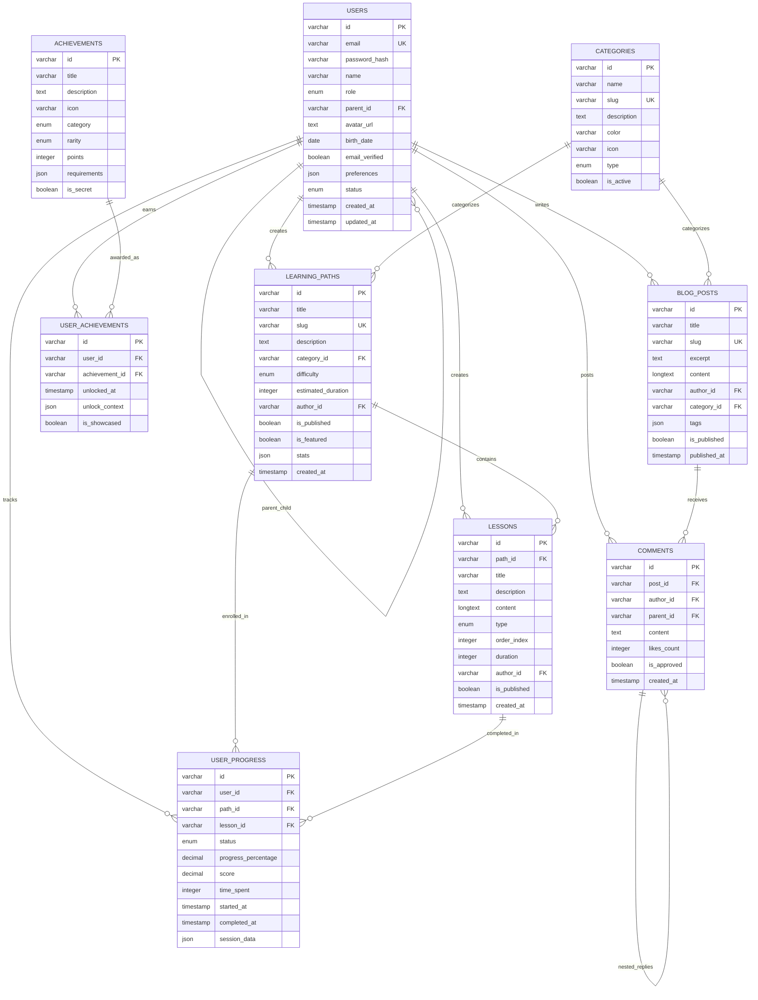

# 🗄️ MyLightWay - Database Design

> **Arquitetura de banco de dados completa para a plataforma MyLightWay**

## 📋 Índice

- [Visão Geral](#-visão-geral)
- [Diagrama ER](#-diagrama-er)
- [Tabelas Principais](#-tabelas-principais)
- [Relacionamentos](#-relacionamentos)
- [Índices e Performance](#-índices-e-performance)
- [Migrations](#-migrations)
- [Seeds e Dados Iniciais](#-seeds-e-dados-iniciais)

---

## 🌟 Visão Geral

### 🎯 Estratégia de Database

- **SGBD Principal**: PostgreSQL 15+
- **Cache Layer**: Redis 7.0+
- **Search Engine**: Elasticsearch 8.0+ (opcional)
- **File Storage**: AWS S3 / CloudFlare R2
- **Backup Strategy**: Daily automated backups + Point-in-time recovery

### 📊 Estatísticas Projetadas

| Métrica | Valor Estimado | Crescimento |
|---------|----------------|-------------|
| **Usuários ativos** | 100,000 | +20% mensal |
| **Trilhas de aprendizado** | 500 | +10 novas/mês |
| **Lições totais** | 5,000 | +100 novas/mês |
| **Progresso registrado** | 10M+ registros | +500K/mês |
| **Tamanho do DB** | ~50GB | +5GB/mês |

### 🏗️ Arquitetura

```
┌─────────────────┐    ┌─────────────────┐    ┌─────────────────┐
│   Application   │    │     Redis       │    │  Elasticsearch  │
│    Servers      │◄──►│     Cache       │    │   (Search)      │
└─────────────────┘    └─────────────────┘    └─────────────────┘
         │                       │                       │
         ▼                       ▼                       ▼
┌─────────────────────────────────────────────────────────────────┐
│                    PostgreSQL Primary                           │
│                  (Read/Write Operations)                        │
└─────────────────────────────────────────────────────────────────┘
         │
         ▼
┌─────────────────────────────────────────────────────────────────┐
│                   PostgreSQL Replicas                          │
│                   (Read-Only Operations)                        │
└─────────────────────────────────────────────────────────────────┘
```

---

## 🔄 Diagrama ER



---

## 📋 Tabelas Principais

### 1. Users Table

```sql
CREATE TABLE users (
    -- Primary Key
    id VARCHAR(20) PRIMARY KEY DEFAULT ('usr_' || generate_random_string(10)),
    
    -- Authentication
    email VARCHAR(255) UNIQUE NOT NULL,
    password_hash VARCHAR(255) NOT NULL,
    email_verified BOOLEAN NOT NULL DEFAULT FALSE,
    phone_verified BOOLEAN NOT NULL DEFAULT FALSE,
    two_factor_secret VARCHAR(32),
    two_factor_enabled BOOLEAN NOT NULL DEFAULT FALSE,
    
    -- Profile
    name VARCHAR(100) NOT NULL,
    avatar_url TEXT,
    birth_date DATE,
    gender VARCHAR(20),
    
    -- Role & Relationships
    role user_role_enum NOT NULL DEFAULT 'child',
    parent_id VARCHAR(20) REFERENCES users(id) ON DELETE SET NULL,
    
    -- Settings & Preferences
    preferences JSONB DEFAULT '{}',
    privacy_settings JSONB DEFAULT '{}',
    notification_settings JSONB DEFAULT '{}',
    
    -- Status & Subscription
    status user_status_enum NOT NULL DEFAULT 'pending_verification',
    subscription_tier subscription_tier_enum NOT NULL DEFAULT 'free',
    subscription_expires_at TIMESTAMP WITH TIME ZONE,
    
    -- Security & Tracking
    login_attempts INTEGER NOT NULL DEFAULT 0,
    locked_until TIMESTAMP WITH TIME ZONE,
    last_login_at TIMESTAMP WITH TIME ZONE,
    last_active_at TIMESTAMP WITH TIME ZONE,
    last_login_ip INET,
    
    -- Timestamps
    created_at TIMESTAMP WITH TIME ZONE NOT NULL DEFAULT NOW(),
    updated_at TIMESTAMP WITH TIME ZONE NOT NULL DEFAULT NOW(),
    deleted_at TIMESTAMP WITH TIME ZONE,
    
    -- Constraints
    CONSTRAINT check_age CHECK (
        role != 'child' OR 
        birth_date IS NULL OR 
        birth_date >= CURRENT_DATE - INTERVAL '18 years'
    ),
    CONSTRAINT check_parent_relationship CHECK (
        (role = 'child' AND parent_id IS NOT NULL) OR
        (role != 'child' AND parent_id IS NULL)
    )
);

-- Enums
CREATE TYPE user_role_enum AS ENUM ('child', 'parent', 'educator', 'admin', 'content_creator');
CREATE TYPE user_status_enum AS ENUM ('active', 'suspended', 'pending_verification', 'deleted');
CREATE TYPE subscription_tier_enum AS ENUM ('free', 'pro', 'family', 'educator', 'enterprise');
```

### 2. Learning Paths Table

```sql
CREATE TABLE learning_paths (
    -- Primary Key
    id VARCHAR(20) PRIMARY KEY DEFAULT ('lp_' || generate_random_string(8)),
    
    -- Basic Info
    title VARCHAR(255) NOT NULL,
    slug VARCHAR(255) UNIQUE NOT NULL,
    description TEXT NOT NULL,
    detailed_description TEXT,
    
    -- Media
    cover_image_url TEXT,
    preview_video_url TEXT,
    thumbnail_url TEXT,
    
    -- Classification
    category_id VARCHAR(20) NOT NULL REFERENCES categories(id),
    difficulty difficulty_enum NOT NULL DEFAULT 'beginner',
    
    -- Structure
    estimated_duration INTEGER NOT NULL DEFAULT 0, -- minutes
    lessons_count INTEGER NOT NULL DEFAULT 0,
    order_index INTEGER NOT NULL DEFAULT 0,
    
    -- Learning Design
    learning_objectives JSONB DEFAULT '[]',
    prerequisites JSONB DEFAULT '[]', -- Array of path IDs
    skills_developed JSONB DEFAULT '[]',
    target_age_groups JSONB DEFAULT '[]',
    
    -- Content Management
    author_id VARCHAR(20) NOT NULL REFERENCES users(id),
    collaborators JSONB DEFAULT '[]', -- Array of user IDs
    content_version VARCHAR(20) NOT NULL DEFAULT '1.0.0',
    
    -- Publishing
    is_published BOOLEAN NOT NULL DEFAULT FALSE,
    is_featured BOOLEAN NOT NULL DEFAULT FALSE,
    is_premium BOOLEAN NOT NULL DEFAULT FALSE,
    publication_date TIMESTAMP WITH TIME ZONE,
    access_level access_level_enum NOT NULL DEFAULT 'free',
    
    -- SEO & Marketing
    seo_title VARCHAR(255),
    seo_description TEXT,
    seo_keywords JSONB DEFAULT '[]',
    marketing_tags JSONB DEFAULT '[]',
    
    -- Statistics (updated via triggers)
    stats JSONB DEFAULT '{
        "enrolled_count": 0,
        "completed_count": 0,
        "average_rating": 0,
        "total_reviews": 0,
        "completion_rate": 0,
        "average_duration": 0
    }',
    
    -- Timestamps
    created_at TIMESTAMP WITH TIME ZONE NOT NULL DEFAULT NOW(),
    updated_at TIMESTAMP WITH TIME ZONE NOT NULL DEFAULT NOW(),
    published_at TIMESTAMP WITH TIME ZONE,
    last_modified_by VARCHAR(20) NOT NULL REFERENCES users(id),
    deleted_at TIMESTAMP WITH TIME ZONE,
    
    -- Constraints
    CONSTRAINT check_lessons_count CHECK (lessons_count >= 0),
    CONSTRAINT check_duration CHECK (estimated_duration >= 0),
    CONSTRAINT check_publication CHECK (
        (is_published = FALSE) OR 
        (is_published = TRUE AND publication_date IS NOT NULL)
    )
);

-- Enums
CREATE TYPE difficulty_enum AS ENUM ('beginner', 'intermediate', 'advanced');
CREATE TYPE access_level_enum AS ENUM ('free', 'pro', 'premium', 'enterprise');
```

### 3. Lessons Table

```sql
CREATE TABLE lessons (
    -- Primary Key
    id VARCHAR(20) PRIMARY KEY DEFAULT ('lsn_' || generate_random_string(8)),
    
    -- Relationships
    path_id VARCHAR(20) NOT NULL REFERENCES learning_paths(id) ON DELETE CASCADE,
    
    -- Basic Info
    title VARCHAR(255) NOT NULL,
    description TEXT NOT NULL,
    
    -- Content
    content JSONB NOT NULL DEFAULT '{}',
    content_type lesson_type_enum NOT NULL DEFAULT 'interactive',
    
    -- Structure
    order_index INTEGER NOT NULL,
    duration INTEGER NOT NULL DEFAULT 0, -- minutes
    difficulty difficulty_enum NOT NULL DEFAULT 'beginner',
    
    -- Learning Design
    objectives JSONB DEFAULT '[]',
    prerequisites JSONB DEFAULT '[]', -- Array of lesson IDs
    vocabulary JSONB DEFAULT '[]', -- Key terms introduced
    
    -- Content Elements
    has_video BOOLEAN NOT NULL DEFAULT FALSE,
    has_audio BOOLEAN NOT NULL DEFAULT FALSE,
    has_quiz BOOLEAN NOT NULL DEFAULT FALSE,
    has_activities BOOLEAN NOT NULL DEFAULT FALSE,
    interactive_elements_count INTEGER NOT NULL DEFAULT 0,
    
    -- Publishing & Access
    is_published BOOLEAN NOT NULL DEFAULT FALSE,
    is_required BOOLEAN NOT NULL DEFAULT TRUE,
    is_bonus BOOLEAN NOT NULL DEFAULT FALSE,
    
    -- Unlock Conditions
    unlock_conditions JSONB DEFAULT '[]',
    unlock_delay_hours INTEGER DEFAULT 0, -- Time gate
    
    -- Content Management
    author_id VARCHAR(20) NOT NULL REFERENCES users(id),
    content_version VARCHAR(20) NOT NULL DEFAULT '1.0.0',
    
    -- Analytics
    completion_stats JSONB DEFAULT '{
        "total_attempts": 0,
        "successful_completions": 0,
        "average_score": 0,
        "average_duration": 0,
        "bounce_rate": 0
    }',
    
    -- Timestamps
    created_at TIMESTAMP WITH TIME ZONE NOT NULL DEFAULT NOW(),
    updated_at TIMESTAMP WITH TIME ZONE NOT NULL DEFAULT NOW(),
    deleted_at TIMESTAMP WITH TIME ZONE,
    
    -- Constraints
    CONSTRAINT unique_lesson_order UNIQUE (path_id, order_index),
    CONSTRAINT check_duration_positive CHECK (duration >= 0),
    CONSTRAINT check_order_positive CHECK (order_index >= 0)
);

-- Enums
CREATE TYPE lesson_type_enum AS ENUM (
    'reading', 'video', 'audio', 'interactive', 
    'quiz', 'activity', 'game', 'assessment'
);
```

### 4. User Progress Table

```sql
CREATE TABLE user_progress (
    -- Primary Key
    id VARCHAR(20) PRIMARY KEY DEFAULT ('prg_' || generate_random_string(10)),
    
    -- Relationships
    user_id VARCHAR(20) NOT NULL REFERENCES users(id) ON DELETE CASCADE,
    path_id VARCHAR(20) REFERENCES learning_paths(id) ON DELETE CASCADE,
    lesson_id VARCHAR(20) REFERENCES lessons(id) ON DELETE CASCADE,
    
    -- Progress Status
    status progress_status_enum NOT NULL DEFAULT 'not_started',
    progress_percentage DECIMAL(5,2) NOT NULL DEFAULT 0.00 CHECK (
        progress_percentage >= 0.00 AND progress_percentage <= 100.00
    ),
    
    -- Performance Metrics
    score DECIMAL(5,2) CHECK (score >= 0.00 AND score <= 100.00),
    best_score DECIMAL(5,2) CHECK (best_score >= 0.00 AND best_score <= 100.00),
    attempts_count INTEGER NOT NULL DEFAULT 0,
    successful_attempts INTEGER NOT NULL DEFAULT 0,
    
    -- Time Tracking
    time_spent INTEGER NOT NULL DEFAULT 0, -- total seconds
    active_time INTEGER NOT NULL DEFAULT 0, -- actual engagement time
    pause_time INTEGER NOT NULL DEFAULT 0, -- time spent paused
    
    -- Session Data
    current_session_id VARCHAR(20),
    session_data JSONB DEFAULT '{}',
    bookmark_data JSONB DEFAULT '{}', -- Where user left off
    
    -- Learning Analytics
    engagement_metrics JSONB DEFAULT '{
        "interaction_count": 0,
        "help_requests": 0,
        "hint_usage": 0,
        "replay_count": 0,
        "difficulty_adjustments": 0
    }',
    
    learning_insights JSONB DEFAULT '[]',
    behavioral_patterns JSONB DEFAULT '{}',
    
    -- Streak & Consistency
    daily_streak INTEGER NOT NULL DEFAULT 0,
    weekly_streak INTEGER NOT NULL DEFAULT 0,
    last_streak_date DATE,
    
    -- Timestamps
    started_at TIMESTAMP WITH TIME ZONE,
    last_activity_at TIMESTAMP WITH TIME ZONE,
    completed_at TIMESTAMP WITH TIME ZONE,
    created_at TIMESTAMP WITH TIME ZONE NOT NULL DEFAULT NOW(),
    updated_at TIMESTAMP WITH TIME ZONE NOT NULL DEFAULT NOW(),
    
    -- Constraints
    CONSTRAINT unique_user_lesson UNIQUE (user_id, lesson_id),
    CONSTRAINT unique_user_path UNIQUE (user_id, path_id),
    CONSTRAINT check_one_target CHECK (
        (path_id IS NOT NULL AND lesson_id IS NULL) OR
        (path_id IS NULL AND lesson_id IS NOT NULL)
    ),
    CONSTRAINT check_completion_logic CHECK (
        (status != 'completed') OR 
        (status = 'completed' AND completed_at IS NOT NULL)
    ),
    CONSTRAINT check_attempts_consistency CHECK (
        successful_attempts <= attempts_count
    )
);

-- Enums
CREATE TYPE progress_status_enum AS ENUM (
    'not_started', 'in_progress', 'completed', 'abandoned', 'locked'
);
```

### 5. Achievements System

```sql
-- Achievements definition table
CREATE TABLE achievements (
    -- Primary Key (descriptive ID)
    id VARCHAR(50) PRIMARY KEY, -- e.g., 'first_lesson_completed'
    
    -- Display Information
    title VARCHAR(255) NOT NULL,
    description TEXT NOT NULL,
    icon VARCHAR(10) NOT NULL, -- Unicode emoji
    badge_image_url TEXT,
    color VARCHAR(7) NOT NULL, -- Hex color code
    
    -- Classification
    category achievement_category_enum NOT NULL,
    rarity achievement_rarity_enum NOT NULL DEFAULT 'common',
    tier INTEGER NOT NULL DEFAULT 1, -- For progressive achievements
    
    -- Game Mechanics
    points INTEGER NOT NULL DEFAULT 0,
    xp_reward INTEGER NOT NULL DEFAULT 0,
    
    -- Requirements & Conditions
    requirements JSONB NOT NULL,
    unlock_conditions JSONB DEFAULT '[]',
    
    -- Visibility
    is_secret BOOLEAN NOT NULL DEFAULT FALSE,
    is_active BOOLEAN NOT NULL DEFAULT TRUE,
    hint TEXT, -- For secret achievements
    
    -- Metadata
    unlock_message TEXT,
    celebration_animation VARCHAR(50),
    sound_effect_url TEXT,
    
    -- Statistics (updated via triggers)
    total_unlocks INTEGER NOT NULL DEFAULT 0,
    unlock_rate DECIMAL(6,4) NOT NULL DEFAULT 0.0000, -- Percentage of users
    first_unlocked_at TIMESTAMP WITH TIME ZONE,
    first_unlocked_by VARCHAR(20) REFERENCES users(id),
    
    -- Timestamps
    created_at TIMESTAMP WITH TIME ZONE NOT NULL DEFAULT NOW(),
    updated_at TIMESTAMP WITH TIME ZONE NOT NULL DEFAULT NOW(),
    
    -- Constraints
    CONSTRAINT check_positive_points CHECK (points >= 0),
    CONSTRAINT check_positive_xp CHECK (xp_reward >= 0),
    CONSTRAINT check_tier_positive CHECK (tier > 0)
);

-- User achievements junction table
CREATE TABLE user_achievements (
    -- Primary Key
    id VARCHAR(20) PRIMARY KEY DEFAULT ('uach_' || generate_random_string(10)),
    
    -- Relationships
    user_id VARCHAR(20) NOT NULL REFERENCES users(id) ON DELETE CASCADE,
    achievement_id VARCHAR(50) NOT NULL REFERENCES achievements(id) ON DELETE CASCADE,
    
    -- Unlock Details
    unlocked_at TIMESTAMP WITH TIME ZONE NOT NULL DEFAULT NOW(),
    unlock_context JSONB, -- What triggered the unlock
    
    -- Progress Tracking (for progressive achievements)
    current_progress INTEGER DEFAULT 0,
    target_progress INTEGER,
    milestone_progress JSONB DEFAULT '[]',
    
    -- Social Features
    is_showcased BOOLEAN NOT NULL DEFAULT TRUE,
    shared_at TIMESTAMP WITH TIME ZONE,
    share_count INTEGER NOT NULL DEFAULT 0,
    reactions JSONB DEFAULT '{}',
    
    -- Notifications
    notification_sent BOOLEAN NOT NULL DEFAULT FALSE,
    viewed_at TIMESTAMP WITH TIME ZONE,
    
    -- Constraints
    CONSTRAINT unique_user_achievement UNIQUE (user_id, achievement_id),
    CONSTRAINT check_progress_logic CHECK (
        (current_progress IS NULL AND target_progress IS NULL) OR
        (current_progress >= 0 AND target_progress > 0 AND current_progress <= target_progress)
    )
);

-- Enums
CREATE TYPE achievement_category_enum AS ENUM (
    'completion', 'streak', 'mastery', 'exploration', 
    'social', 'special', 'seasonal', 'community'
);

CREATE TYPE achievement_rarity_enum AS ENUM (
    'common', 'uncommon', 'rare', 'epic', 'legendary', 'mythical'
);
```

### 6. Categories & Content Organization

```sql
CREATE TABLE categories (
    -- Primary Key
    id VARCHAR(20) PRIMARY KEY DEFAULT ('cat_' || generate_random_string(8)),
    
    -- Basic Information
    name VARCHAR(100) NOT NULL,
    slug VARCHAR(100) UNIQUE NOT NULL,
    description TEXT,
    
    -- Visual Identity
    color VARCHAR(7) NOT NULL, -- Hex color
    icon VARCHAR(10) NOT NULL, -- Unicode emoji
    cover_image_url TEXT,
    
    -- Hierarchy
    parent_id VARCHAR(20) REFERENCES categories(id) ON DELETE SET NULL,
    level INTEGER NOT NULL DEFAULT 0, -- 0 = root, 1 = sub, etc.
    path TEXT, -- Materialized path: "parent_id/child_id"
    
    -- Organization
    type category_type_enum NOT NULL,
    order_index INTEGER NOT NULL DEFAULT 0,
    
    -- Status & Visibility
    is_active BOOLEAN NOT NULL DEFAULT TRUE,
    is_featured BOOLEAN NOT NULL DEFAULT FALSE,
    
    -- Content Statistics (updated via triggers)
    content_count INTEGER NOT NULL DEFAULT 0,
    total_lessons INTEGER NOT NULL DEFAULT 0,
    total_duration INTEGER NOT NULL DEFAULT 0, -- minutes
    
    -- SEO
    seo_title VARCHAR(255),
    seo_description TEXT,
    
    -- Timestamps
    created_at TIMESTAMP WITH TIME ZONE NOT NULL DEFAULT NOW(),
    updated_at TIMESTAMP WITH TIME ZONE NOT NULL DEFAULT NOW(),
    
    -- Constraints
    CONSTRAINT check_no_self_parent CHECK (id != parent_id),
    CONSTRAINT check_level_consistency CHECK (
        (parent_id IS NULL AND level = 0) OR
        (parent_id IS NOT NULL AND level > 0)
    )
);

-- Age groups for content targeting
CREATE TABLE age_groups (
    -- Primary Key
    id VARCHAR(20) PRIMARY KEY DEFAULT ('ag_' || generate_random_string(8)),
    
    -- Basic Information
    name VARCHAR(100) NOT NULL,
    min_age INTEGER NOT NULL,
    max_age INTEGER NOT NULL,
    color VARCHAR(7) NOT NULL,
    
    -- Characteristics
    description TEXT,
    characteristics JSONB DEFAULT '[]',
    learning_focus JSONB DEFAULT '[]',
    
    -- Recommendations
    recommended_session_duration INTEGER, -- minutes
    max_daily_time INTEGER, -- minutes
    break_frequency INTEGER, -- minutes between breaks
    
    -- Content Guidelines
    content_guidelines JSONB DEFAULT '{}',
    safety_restrictions JSONB DEFAULT '{}',
    
    -- Status
    is_active BOOLEAN NOT NULL DEFAULT TRUE,
    order_index INTEGER NOT NULL DEFAULT 0,
    
    -- Timestamps
    created_at TIMESTAMP WITH TIME ZONE NOT NULL DEFAULT NOW(),
    updated_at TIMESTAMP WITH TIME ZONE NOT NULL DEFAULT NOW(),
    
    -- Constraints
    CONSTRAINT check_age_range CHECK (min_age >= 0 AND max_age > min_age),
    CONSTRAINT check_durations CHECK (
        recommended_session_duration IS NULL OR recommended_session_duration > 0
    )
);

-- Many-to-many relationship: paths and age groups
CREATE TABLE path_age_groups (
    path_id VARCHAR(20) NOT NULL REFERENCES learning_paths(id) ON DELETE CASCADE,
    age_group_id VARCHAR(20) NOT NULL REFERENCES age_groups(id) ON DELETE CASCADE,
    
    PRIMARY KEY (path_id, age_group_id)
);

-- Enums
CREATE TYPE category_type_enum AS ENUM ('content', 'blog', 'resource', 'community');
```

---

## 🔗 Relacionamentos

### Principais Relacionamentos

```sql
-- 1. User Hierarchy (Parent-Child)
ALTER TABLE users ADD CONSTRAINT fk_users_parent
    FOREIGN KEY (parent_id) REFERENCES users(id) ON DELETE SET NULL;

-- 2. Content Authorship
ALTER TABLE learning_paths ADD CONSTRAINT fk_paths_author
    FOREIGN KEY (author_id) REFERENCES users(id) ON DELETE RESTRICT;

ALTER TABLE lessons ADD CONSTRAINT fk_lessons_author
    FOREIGN KEY (author_id) REFERENCES users(id) ON DELETE RESTRICT;

-- 3. Learning Structure
ALTER TABLE lessons ADD CONSTRAINT fk_lessons_path
    FOREIGN KEY (path_id) REFERENCES learning_paths(id) ON DELETE CASCADE;

ALTER TABLE learning_paths ADD CONSTRAINT fk_paths_category
    FOREIGN KEY (category_id) REFERENCES categories(id) ON DELETE RESTRICT;

-- 4. Progress Tracking
ALTER TABLE user_progress ADD CONSTRAINT fk_progress_user
    FOREIGN KEY (user_id) REFERENCES users(id) ON DELETE CASCADE;

ALTER TABLE user_progress ADD CONSTRAINT fk_progress_path
    FOREIGN KEY (path_id) REFERENCES learning_paths(id) ON DELETE CASCADE;

ALTER TABLE user_progress ADD CONSTRAINT fk_progress_lesson
    FOREIGN KEY (lesson_id) REFERENCES lessons(id) ON DELETE CASCADE;

-- 5. Achievement System
ALTER TABLE user_achievements ADD CONSTRAINT fk_user_achievements_user
    FOREIGN KEY (user_id) REFERENCES users(id) ON DELETE CASCADE;

ALTER TABLE user_achievements ADD CONSTRAINT fk_user_achievements_achievement
    FOREIGN KEY (achievement_id) REFERENCES achievements(id) ON DELETE CASCADE;
```

### Indexes para Performance

```sql
-- Users table indexes
CREATE INDEX idx_users_email ON users(email);
CREATE INDEX idx_users_parent_id ON users(parent_id);
CREATE INDEX idx_users_role_status ON users(role, status);
CREATE INDEX idx_users_created_at ON users(created_at);
CREATE INDEX idx_users_last_active ON users(last_active_at);

-- Learning paths indexes
CREATE INDEX idx_paths_category_published ON learning_paths(category_id, is_published);
CREATE INDEX idx_paths_difficulty_featured ON learning_paths(difficulty, is_featured);
CREATE INDEX idx_paths_author ON learning_paths(author_id);
CREATE INDEX idx_paths_publication_date ON learning_paths(publication_date);
CREATE GIN INDEX idx_paths_search ON learning_paths USING gin(to_tsvector('portuguese', title || ' ' || description));

-- Lessons table indexes
CREATE INDEX idx_lessons_path_order ON lessons(path_id, order_index);
CREATE INDEX idx_lessons_type_published ON lessons(content_type, is_published);
CREATE INDEX idx_lessons_author ON lessons(author_id);
CREATE INDEX idx_lessons_duration ON lessons(duration);

-- User progress indexes
CREATE INDEX idx_progress_user_status ON user_progress(user_id, status);
CREATE INDEX idx_progress_path_status ON user_progress(path_id, status);
CREATE INDEX idx_progress_lesson_status ON user_progress(lesson_id, status);
CREATE INDEX idx_progress_last_activity ON user_progress(last_activity_at);
CREATE INDEX idx_progress_completed_at ON user_progress(completed_at);

-- User achievements indexes
CREATE INDEX idx_user_achievements_user ON user_achievements(user_id);
CREATE INDEX idx_user_achievements_unlocked_at ON user_achievements(unlocked_at);
CREATE INDEX idx_user_achievements_showcased ON user_achievements(is_showcased, unlocked_at);

-- Categories indexes
CREATE INDEX idx_categories_type_active ON categories(type, is_active);
CREATE INDEX idx_categories_parent_order ON categories(parent_id, order_index);
CREATE INDEX idx_categories_featured ON categories(is_featured, order_index);

-- Age groups indexes
CREATE INDEX idx_age_groups_range ON age_groups(min_age, max_age);
CREATE INDEX idx_age_groups_active ON age_groups(is_active, order_index);
```

---

## 📈 Performance & Optimization

### Partitioning Strategy

```sql
-- Partition user_progress by date for better performance
CREATE TABLE user_progress_y2025m01 PARTITION OF user_progress
FOR VALUES FROM ('2025-01-01') TO ('2025-02-01');

CREATE TABLE user_progress_y2025m02 PARTITION OF user_progress
FOR VALUES FROM ('2025-02-01') TO ('2025-03-01');

-- Continue creating monthly partitions...

-- Partition achievements by category for better query performance
CREATE TABLE user_achievements_completion PARTITION OF user_achievements
FOR VALUES IN ('completion');

CREATE TABLE user_achievements_streak PARTITION OF user_achievements
FOR VALUES IN ('streak');

CREATE TABLE user_achievements_mastery PARTITION OF user_achievements
FOR VALUES IN ('mastery');
```

### Views para Queries Comuns

```sql
-- View: User statistics summary
CREATE VIEW user_stats_summary AS
SELECT 
    u.id,
    u.name,
    u.role,
    COUNT(DISTINCT up_path.id) as enrolled_paths,
    COUNT(DISTINCT CASE WHEN up_path.status = 'completed' THEN up_path.id END) as completed_paths,
    COUNT(DISTINCT up_lesson.id) as total_lessons_attempted,
    COUNT(DISTINCT CASE WHEN up_lesson.status = 'completed' THEN up_lesson.id END) as completed_lessons,
    COALESCE(SUM(up_lesson.time_spent), 0) as total_study_time,
    COUNT(DISTINCT ua.id) as total_achievements,
    COALESCE(SUM(a.points), 0) as total_points,
    MAX(up_lesson.last_activity_at) as last_activity_at
FROM users u
LEFT JOIN user_progress up_path ON u.id = up_path.user_id AND up_path.path_id IS NOT NULL
LEFT JOIN user_progress up_lesson ON u.id = up_lesson.user_id AND up_lesson.lesson_id IS NOT NULL
LEFT JOIN user_achievements ua ON u.id = ua.user_id
LEFT JOIN achievements a ON ua.achievement_id = a.id
WHERE u.deleted_at IS NULL
GROUP BY u.id, u.name, u.role;

-- View: Learning path with statistics
CREATE VIEW learning_paths_with_stats AS
SELECT 
    lp.*,
    COUNT(DISTINCT l.id) as actual_lessons_count,
    COUNT(DISTINCT up.user_id) as enrolled_users,
    COUNT(DISTINCT CASE WHEN up.status = 'completed' THEN up.user_id END) as completed_users,
    ROUND(AVG(CASE WHEN up.status = 'completed' THEN up.score END), 2) as average_score,
    ROUND(AVG(CASE WHEN up.status = 'completed' THEN up.time_spent END), 2) as average_completion_time
FROM learning_paths lp
LEFT JOIN lessons l ON lp.id = l.path_id AND l.deleted_at IS NULL
LEFT JOIN user_progress up ON lp.id = up.path_id
WHERE lp.deleted_at IS NULL
GROUP BY lp.id;

-- View: User progress with path details
CREATE VIEW user_progress_detailed AS
SELECT 
    up.*,
    lp.title as path_title,
    lp.difficulty as path_difficulty,
    l.title as lesson_title,
    l.content_type as lesson_type,
    l.duration as lesson_duration,
    CASE 
        WHEN up.lesson_id IS NOT NULL THEN 'lesson'
        WHEN up.path_id IS NOT NULL THEN 'path'
    END as progress_type
FROM user_progress up
LEFT JOIN learning_paths lp ON up.path_id = lp.id
LEFT JOIN lessons l ON up.lesson_id = l.id;
```

### Triggers para Manutenção Automática

```sql
-- Update learning_paths.lessons_count when lessons are added/removed
CREATE OR REPLACE FUNCTION update_path_lessons_count()
RETURNS TRIGGER AS $$
BEGIN
    IF TG_OP = 'DELETE' THEN
        UPDATE learning_paths 
        SET lessons_count = lessons_count - 1,
            updated_at = NOW()
        WHERE id = OLD.path_id;
        RETURN OLD;
    ELSE
        UPDATE learning_paths 
        SET lessons_count = lessons_count + 1,
            updated_at = NOW()
        WHERE id = NEW.path_id;
        RETURN NEW;
    END IF;
END;
$$ LANGUAGE plpgsql;

CREATE TRIGGER trigger_update_path_lessons_count
    AFTER INSERT OR DELETE ON lessons
    FOR EACH ROW EXECUTE FUNCTION update_path_lessons_count();

-- Update achievement unlock statistics
CREATE OR REPLACE FUNCTION update_achievement_stats()
RETURNS TRIGGER AS $$
BEGIN
    UPDATE achievements 
    SET total_unlocks = total_unlocks + 1,
        unlock_rate = (
            SELECT COUNT(*)::DECIMAL / (SELECT COUNT(*) FROM users WHERE role != 'admin')
            FROM user_achievements 
            WHERE achievement_id = NEW.achievement_id
        ),
        first_unlocked_at = COALESCE(first_unlocked_at, NEW.unlocked_at),
        first_unlocked_by = CASE 
            WHEN first_unlocked_at IS NULL THEN NEW.user_id 
            ELSE first_unlocked_by 
        END
    WHERE id = NEW.achievement_id;
    
    RETURN NEW;
END;
$$ LANGUAGE plpgsql;

CREATE TRIGGER trigger_update_achievement_stats
    AFTER INSERT ON user_achievements
    FOR EACH ROW EXECUTE FUNCTION update_achievement_stats();

-- Auto-update timestamps
CREATE OR REPLACE FUNCTION update_updated_at_column()
RETURNS TRIGGER AS $$
BEGIN
    NEW.updated_at = NOW();
    RETURN NEW;
END;
$$ LANGUAGE plpgsql;

-- Apply to all main tables
CREATE TRIGGER update_users_updated_at BEFORE UPDATE ON users
    FOR EACH ROW EXECUTE FUNCTION update_updated_at_column();

CREATE TRIGGER update_learning_paths_updated_at BEFORE UPDATE ON learning_paths
    FOR EACH ROW EXECUTE FUNCTION update_updated_at_column();

CREATE TRIGGER update_lessons_updated_at BEFORE UPDATE ON lessons
    FOR EACH ROW EXECUTE FUNCTION update_updated_at_column();

CREATE TRIGGER update_user_progress_updated_at BEFORE UPDATE ON user_progress
    FOR EACH ROW EXECUTE FUNCTION update_updated_at_column();
```

---

## 🔄 Migrations

### Migration Strategy

```sql
-- migrations/001_create_base_tables.sql
-- Initial database schema creation

-- migrations/002_add_user_preferences.sql
-- Add user preferences and settings

-- migrations/003_create_achievements_system.sql
-- Achievement and gamification system

-- migrations/004_add_content_versioning.sql
-- Version control for content

-- migrations/005_add_analytics_tracking.sql
-- Enhanced analytics and tracking

-- migrations/006_optimize_indexes.sql
-- Performance optimization indexes

-- migrations/007_add_social_features.sql
-- Social interaction features

-- migrations/008_add_parental_controls.sql
-- Enhanced parental control features
```

### Sample Migration File

```sql
-- migrations/003_create_achievements_system.sql
BEGIN;

-- Create achievement categories enum
CREATE TYPE achievement_category_enum AS ENUM (
    'completion', 'streak', 'mastery', 'exploration', 
    'social', 'special', 'seasonal', 'community'
);

-- Create achievement rarity enum  
CREATE TYPE achievement_rarity_enum AS ENUM (
    'common', 'uncommon', 'rare', 'epic', 'legendary', 'mythical'
);

-- Create achievements table
CREATE TABLE achievements (
    id VARCHAR(50) PRIMARY KEY,
    title VARCHAR(255) NOT NULL,
    description TEXT NOT NULL,
    icon VARCHAR(10) NOT NULL,
    badge_image_url TEXT,
    color VARCHAR(7) NOT NULL,
    category achievement_category_enum NOT NULL,
    rarity achievement_rarity_enum NOT NULL DEFAULT 'common',
    tier INTEGER NOT NULL DEFAULT 1,
    points INTEGER NOT NULL DEFAULT 0,
    xp_reward INTEGER NOT NULL DEFAULT 0,
    requirements JSONB NOT NULL,
    unlock_conditions JSONB DEFAULT '[]',
    is_secret BOOLEAN NOT NULL DEFAULT FALSE,
    is_active BOOLEAN NOT NULL DEFAULT TRUE,
    hint TEXT,
    unlock_message TEXT,
    celebration_animation VARCHAR(50),
    sound_effect_url TEXT,
    total_unlocks INTEGER NOT NULL DEFAULT 0,
    unlock_rate DECIMAL(6,4) NOT NULL DEFAULT 0.0000,
    first_unlocked_at TIMESTAMP WITH TIME ZONE,
    first_unlocked_by VARCHAR(20) REFERENCES users(id),
    created_at TIMESTAMP WITH TIME ZONE NOT NULL DEFAULT NOW(),
    updated_at TIMESTAMP WITH TIME ZONE NOT NULL DEFAULT NOW(),
    
    CONSTRAINT check_positive_points CHECK (points >= 0),
    CONSTRAINT check_positive_xp CHECK (xp_reward >= 0),
    CONSTRAINT check_tier_positive CHECK (tier > 0)
);

-- Create user achievements table
CREATE TABLE user_achievements (
    id VARCHAR(20) PRIMARY KEY DEFAULT ('uach_' || generate_random_string(10)),
    user_id VARCHAR(20) NOT NULL REFERENCES users(id) ON DELETE CASCADE,
    achievement_id VARCHAR(50) NOT NULL REFERENCES achievements(id) ON DELETE CASCADE,
    unlocked_at TIMESTAMP WITH TIME ZONE NOT NULL DEFAULT NOW(),
    unlock_context JSONB,
    current_progress INTEGER DEFAULT 0,
    target_progress INTEGER,
    milestone_progress JSONB DEFAULT '[]',
    is_showcased BOOLEAN NOT NULL DEFAULT TRUE,
    shared_at TIMESTAMP WITH TIME ZONE,
    share_count INTEGER NOT NULL DEFAULT 0,
    reactions JSONB DEFAULT '{}',
    notification_sent BOOLEAN NOT NULL DEFAULT FALSE,
    viewed_at TIMESTAMP WITH TIME ZONE,
    
    CONSTRAINT unique_user_achievement UNIQUE (user_id, achievement_id),
    CONSTRAINT check_progress_logic CHECK (
        (current_progress IS NULL AND target_progress IS NULL) OR
        (current_progress >= 0 AND target_progress > 0 AND current_progress <= target_progress)
    )
);

-- Create indexes
CREATE INDEX idx_achievements_category_rarity ON achievements(category, rarity);
CREATE INDEX idx_achievements_points ON achievements(points DESC);
CREATE INDEX idx_achievements_unlock_rate ON achievements(unlock_rate DESC);
CREATE INDEX idx_achievements_is_secret ON achievements(is_secret);

CREATE INDEX idx_user_achievements_user ON user_achievements(user_id);
CREATE INDEX idx_user_achievements_unlocked_at ON user_achievements(unlocked_at DESC);
CREATE INDEX idx_user_achievements_showcased ON user_achievements(is_showcased, unlocked_at DESC);

-- Create trigger for updating achievement stats
CREATE TRIGGER trigger_update_achievement_stats
    AFTER INSERT ON user_achievements
    FOR EACH ROW EXECUTE FUNCTION update_achievement_stats();

-- Insert initial achievements
INSERT INTO achievements (id, title, description, icon, color, category, rarity, points, requirements) VALUES
('first_lesson_completed', 'Primeira Jornada', 'Complete sua primeira lição no MyLightWay', '🏆', '#FFD700', 'completion', 'common', 50, '{"type": "lessons_completed", "target": 1}'),
('streak_7_days', 'Semana Perfeita', 'Estude por 7 dias consecutivos', '🔥', '#FF6B35', 'streak', 'uncommon', 200, '{"type": "consecutive_days", "target": 7}'),
('path_completed', 'Explorador', 'Complete sua primeira trilha de aprendizado', '🗺️', '#4ECDC4', 'completion', 'rare', 500, '{"type": "paths_completed", "target": 1}'),
('perfect_score', 'Perfeição', 'Alcance pontuação perfeita em uma lição', '⭐', '#A8E6CF', 'mastery', 'rare', 300, '{"type": "perfect_score", "target": 1}'),
('helper', 'Pequeno Auxiliar', 'Ajude outro usuário da comunidade', '🤝', '#88D8C0', 'social', 'uncommon', 150, '{"type": "help_others", "target": 1}');

COMMIT;
```

---

## 🌱 Seeds e Dados Iniciais

### Initial Data Setup

```sql
-- seeds/001_categories.sql
INSERT INTO categories (id, name, slug, description, color, icon, type) VALUES
('cat_bible_stories', 'Histórias Bíblicas', 'historias-biblicas', 'Conheça as principais histórias da Bíblia', '#4A90E2', '📚', 'content'),
('cat_values', 'Valores Cristãos', 'valores-cristaos', 'Aprenda sobre amor, bondade e outros valores', '#2ECC71', '❤️', 'content'),
('cat_prayers', 'Oração e Devoção', 'oracao-devocao', 'Momentos de oração e reflexão', '#9B59B6', '🙏', 'content'),
('cat_music', 'Música e Louvor', 'musica-louvor', 'Cânticos e hinos infantis', '#F39C12', '🎵', 'content'),
('cat_activities', 'Atividades', 'atividades', 'Jogos e brincadeiras educativas', '#E74C3C', '🎮', 'content');

-- seeds/002_age_groups.sql
INSERT INTO age_groups (id, name, min_age, max_age, color, description, recommended_session_duration) VALUES
('ag_preschool', 'Pré-escolar', 3, 5, '#FF6B6B', 'Crianças em idade pré-escolar', 15),
('ag_early_elementary', 'Fundamental I', 6, 8, '#4ECDC4', 'Início do ensino fundamental', 25),
('ag_late_elementary', 'Fundamental II', 9, 12, '#45B7D1', 'Final do ensino fundamental', 35);

-- seeds/003_admin_user.sql
INSERT INTO users (id, email, password_hash, name, role, email_verified, status) VALUES
('usr_admin_001', 'admin@mylightway.com', '$2b$12$...', 'Administrador', 'admin', TRUE, 'active');

-- seeds/004_sample_learning_paths.sql
INSERT INTO learning_paths (
    id, title, slug, description, category_id, difficulty, 
    estimated_duration, author_id, is_published, is_featured
) VALUES
('lp_noah_adventure', 'As Aventuras de Noé', 'aventuras-de-noe', 
 'Descubra a incrível história de Noé e a arca através de atividades interativas', 
 'cat_bible_stories', 'beginner', 120, 'usr_admin_001', TRUE, TRUE),
 
('lp_kindness_path', 'O Caminho da Bondade', 'caminho-bondade',
 'Aprenda sobre a bondade através de histórias e exemplos práticos',
 'cat_values', 'beginner', 90, 'usr_admin_001', TRUE, TRUE);

-- seeds/005_sample_lessons.sql
INSERT INTO lessons (
    id, path_id, title, description, content_type, 
    order_index, duration, author_id, is_published
) VALUES
('lsn_noah_calling', 'lp_noah_adventure', 'Deus Chama Noé', 
 'A história de como Deus chamou Noé para uma missão especial',
 'interactive', 1, 15, 'usr_admin_001', TRUE),
 
('lsn_building_ark', 'lp_noah_adventure', 'Construindo a Arca',
 'Noé obedece a Deus e constrói a grande arca',
 'interactive', 2, 18, 'usr_admin_001', TRUE);
```

---

<div align="center">

**MyLightWay Database Design v1.0.0**

Arquitetura robusta e escalável para educação cristã infantil

[📚 Voltar à Documentação](API_DOCUMENTATION.md) · [📝 Contratos](API_CONTRACTS.md) · [🏠 Projeto](../README.md)

</div>